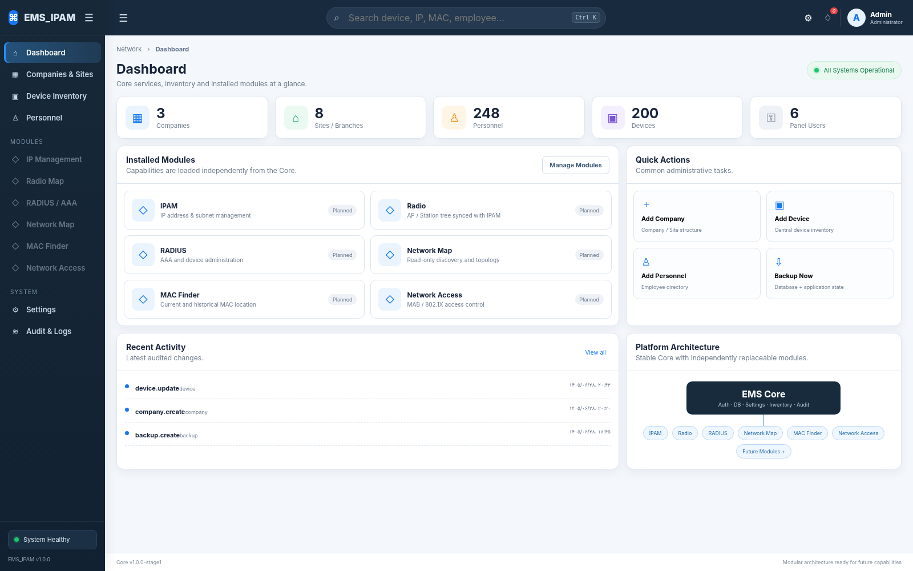

# EMS_IPAM

پلتفرم ماژولار مدیریت زیرساخت شبکه. هسته اصلی مستقل از ماژول‌های IPAM، Radio، RADIUS، Network Map، MAC Finder و Network Access طراحی شده است تا هر بخش جداگانه توسعه و جایگزین شود.

مخزن رسمی: `https://github.com/emsebi/EMS_IPAM`

## وضعیت این خروجی

این بسته **مرحله ۱** پروژه است و شامل موارد زیر است:

- Core / پنل اصلی
- PostgreSQL 16
- Login و Session
- نقش‌های Admin / Support / Helpdesk / Viewer
- Company و Site / Branch
- Personnel Directory
- Device Inventory مرکزی و قابل ویرایش
- Search سراسری با پیشنهاد سریع و انتخاب با کلیدهای جهت‌نما
- Settings متمرکز
- Audit Log
- Backup دستی دیتابیس
- Module Loader و قرارداد افزونه‌ها
- Installer / Update / Uninstall پایدار
- Docker / Docker Compose / Portainer prerequisite bootstrap

ماژول IPAM در **مرحله ۲** به صورت پوشه مستقل `modules/ipam/` اضافه می‌شود و بدون بازسازی Core در منوی اصلی ظاهر خواهد شد.

## تصویر مرحله ۱



## نصب سریع

فقط یک دستور روی Ubuntu/Debian اجرا کنید. اسکریپت وجود Docker Engine، Docker Compose و Portainer را بررسی می‌کند و در صورت نیاز نصب می‌کند:

```bash
curl -fsSL https://raw.githubusercontent.com/emsebi/EMS_IPAM/main/install.sh | sudo bash
```

سپس یکی از گزینه‌ها را انتخاب کنید:

```text
1) Install
2) Update
3) Uninstall application (keep database)
4) Uninstall application + database
```

جزئیات کامل: [docs/INSTALL-FA.md](docs/INSTALL-FA.md)

## معماری ماژولار

```text
EMS_IPAM/
├── core/                  # هسته ثابت
├── modules/               # افزونه‌های مستقل
│   └── _template/         # نمونه قرارداد ماژول
├── docs/
├── scripts/
├── backups/
├── runtime/
├── compose.yml
├── install.sh
└── VERSION
```

هر قابلیت جدید داخل `modules/<module-id>/` قرار می‌گیرد. Core پوشه‌هایی که `module.json` معتبر ندارند نادیده می‌گیرد؛ بنابراین فایل‌های قدیمی یا ناقص مانع بالا آمدن پنل نمی‌شوند.

راهنمای ساخت ماژول: [docs/MODULE-SDK-FA.md](docs/MODULE-SDK-FA.md)

## State پایدار

کد برنامه در:

```text
/opt/ems-ipam
```

و اطلاعات پایدار Installer در:

```text
/var/lib/ems-ipam
```

قرار می‌گیرد. دیتابیس در Docker Volume ثابت `ems_ipam_db_data` نگهداری می‌شود. حذف برنامه با گزینه ۳ دیتابیس و State را نگه می‌دارد و نصب مجدد آن‌ها را استفاده می‌کند.

## اصول پروژه

- Core به هیچ ماژول اختیاری وابسته نیست.
- خراب شدن یک ماژول نباید Core را Down کند.
- همه ماژول‌ها از User / Role / Company / Site / Personnel / Inventory مشترک استفاده می‌کنند.
- اطلاعات تکراری Device بین ماژول‌ها ساخته نمی‌شود.
- هر تغییر حساس در Audit ثبت می‌شود.
- تاریخ‌ها در دیتابیس به صورت استاندارد ذخیره و در رابط کاربری قابل نمایش به تقویم شمسی هستند.
- رمزهای تجهیزات در Core مرحله ۱ ذخیره نمی‌شوند.

## مراحل توسعه

1. Core + Database + Installer **(این بسته)**
2. IPAM
3. Radio Map
4. RADIUS / AAA
5. Network Map
6. MAC Finder
7. Network Access / MAB / 802.1X
8. هر قابلیت آینده به عنوان Module مستقل
