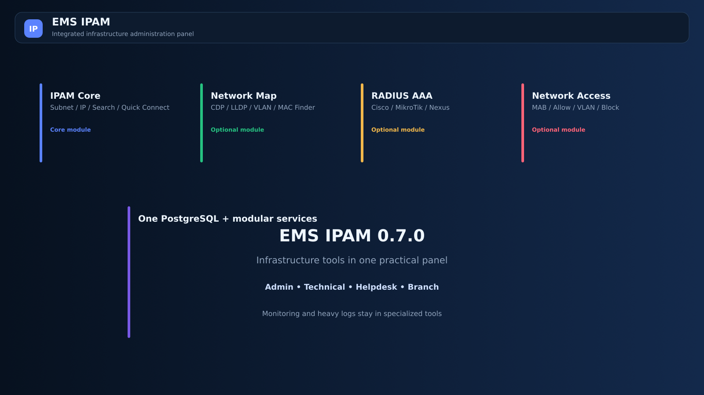
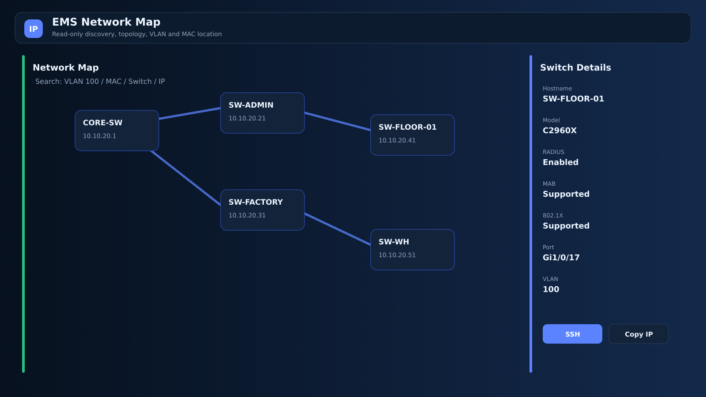
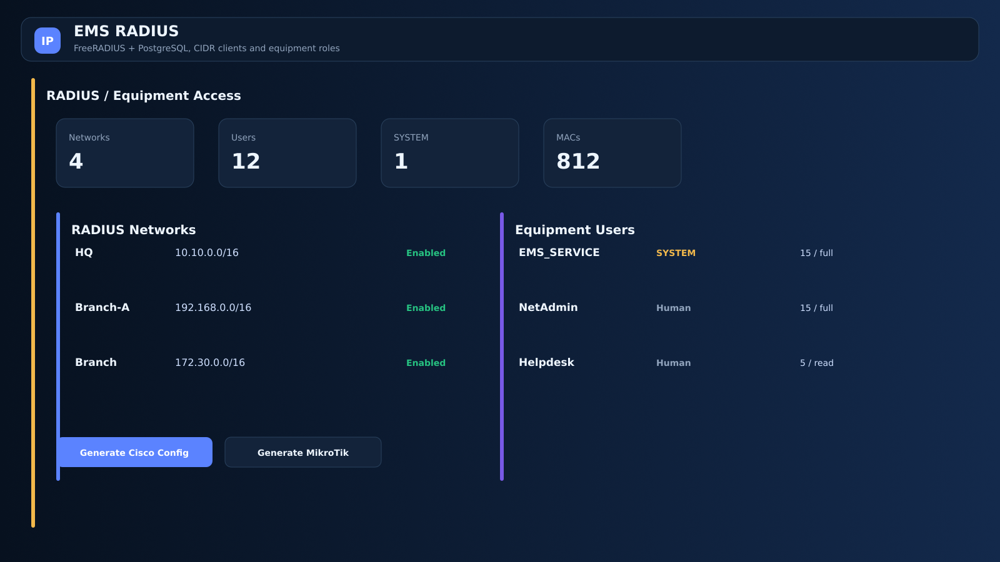
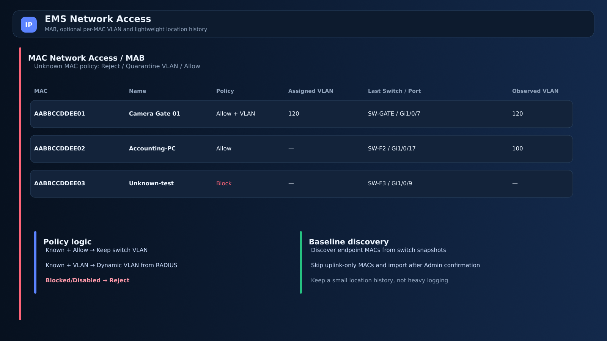

# EMS IPAM v0.7.0

**EMS IPAM** یک پنل وب ماژولار برای کارهای روزمره مدیران شبکه و زیرساخت است. هدف پروژه این نیست که جای Splunk، Zabbix، LibreNMS یا سامانه‌های کامل NAC را بگیرد؛ هدف این است که ابزارهای کوچک و پراکنده‌ای که یک ادمین هر روز لازم دارد، در یک پنل ساده و قابل استفاده جمع شوند.



## امکانات اصلی

- مدیریت رنج‌های IPv4 از `/16` تا `/32` با نمای تصویری، درختی و جدولی
- شرکت، شعبه، رنگ، توضیحات، VLAN، وضعیت IP و اطلاعات تجهیز
- تشخیص IPهای ثبت‌شده و IPهای خالی داخل IPAM
- جست‌وجوی سریع IP، نام، MAC، رنج و اطلاعات مرتبط
- اتصال سریع با SSH، Telnet، WinBox، RDP، HTTP/HTTPS، VNC و پورت دلخواه
- نقش‌های `Admin`، `Technical`، `Helpdesk` و `Branch` به‌همراه سازگاری با نقش‌های قدیمی
- نقشه ساده رادیوهای MikroTik و AP/Station
- گزارش پایه آنلاین‌بودن بدون تبدیل EMS به سامانه مانیتورینگ سنگین
- بکاپ دیتابیس، سطل بازیافت و انتقال مستقل زیرشبکه‌ها
- کلاینت ویندوز برای بازکردن ابزارهای اتصال محلی

### مدیریت IP


### شرکت‌ها و شعب


رکورد IP مرجع اصلی اطلاعات است. تجهیزی که در Network Map کشف می‌شود، در صورت وجود IP متناظر به همان رکورد IPAM متصل می‌شود و رکورد تکراری ساخته نمی‌شود.

## Network Map

ماژول نقشه شبکه در v0.7.0 به پروژه اصلی متصل شده است.



قابلیت‌ها:

- شروع Discovery از یک Seed Switch
- کشف Read-Only با CDP و LLDP
- SSH و در صورت نیاز Telnet برای تجهیزات قدیمی
- نمایش Hostname، Management IP، Model، Serial، OS Version و Uptime
- نمایش Port، Access/Trunk، VLAN و همسایه‌ها
- جست‌وجوی Switch با نام یا IP
- جست‌وجوی `VLAN 100` و Highlight سوییچ‌های دارای آن VLAN
- جست‌وجوی MAC و پیدا کردن سوییچ/پورت نهایی با ترجیح پورت غیر-Uplink
- نمایش اطلاعات پایه RADIUS، MAB و 802.1X روی سوییچ در صورت قابل تشخیص بودن
- افزودن دستی سوییچ‌هایی که با CDP/LLDP کشف نشده‌اند
- Refresh یک سوییچ بدون اسکن کامل شبکه
- استفاده اختیاری از `SYSTEM ACCOUNT` تعریف‌شده در RADIUS برای Discovery و Backup
- اتصال سریع، Copy IP و بازکردن رکورد IPAM
- Backup کمکی کانفیگ، نسخه‌های قبلی و Compare

Discovery برای ساخت نقشه فرمان‌های Read-Only اجرا می‌کند و برای تغییر Configuration سوییچ طراحی نشده است.

جزئیات بیشتر: [Network Map](docs/NETWORK-MAP-v0.7.0-FA.md)

## RADIUS / مدیریت دسترسی تجهیزات

FreeRADIUS به‌صورت ماژول اختیاری در کنار PostgreSQL پروژه قرار گرفته است.



### RADIUS Networks

به‌جای ثبت تک‌تک تجهیزات می‌توان یک CIDR تعریف کرد:

```text
Name: HQ-Network
CIDR: 10.10.0.0/16
Secret: ********
```

هم `/32` و هم Subnet بزرگ پشتیبانی می‌شود. برای مجموعه‌های مختلف می‌توان Secretهای جدا تعریف کرد.

### کاربران مدیریت تجهیزات

هر حساب می‌تواند دسترسی جدا برای پلتفرم‌ها داشته باشد:

```text
MikroTik: none / read / write / full
Cisco IOS/IOS-XE: privilege 0-15
Cisco NX-OS: none / network-operator / network-admin
```

حساب‌های عادی با `Human User` و حساب داخلی برنامه با `SYSTEM ACCOUNT` مشخص می‌شوند. رمز حساب سیستمی به‌صورت AES-256-GCM در دیتابیس ذخیره می‌شود و دوباره در رابط نمایش داده نمی‌شود.

EMS نمونه Configuration برای Cisco AAA، MikroTik و Cisco MAB تولید می‌کند؛ اعمال دستورات روی تجهیزات همچنان تحت کنترل مدیر شبکه است.

جزئیات بیشتر: [RADIUS و MAB](docs/RADIUS-MAB-FA.md)

## MAC Network Access / MAB



هر MAC سه حالت ساده دارد:

- `Allow` — فقط مجاز می‌شود و VLAN همان VLAN پورت سوییچ باقی می‌ماند.
- `Allow + VLAN` — RADIUS VLAN مشخص‌شده برای همان MAC را برمی‌گرداند.
- `Block` — MAC صریحاً Reject می‌شود.

MAC غیرفعال نیز همیشه Reject می‌شود؛ این قانون از Policy عمومی MAC ناشناس اولویت بالاتری دارد.

### سیاست MAC ناشناس

از Settings قابل تغییر است:

```text
Reject
Quarantine VLAN
Allow
```

بنابراین امروز می‌توان MAC ناشناس را به VLAN قرنطینه فرستاد و فردا همان Policy را به Reject تغییر داد، بدون تغییر طراحی دیتابیس.

### Baseline اولیه

Network Map می‌تواند MACهای انتهایی آخرین Snapshot را استخراج کند. MACهایی که فقط روی Uplink دیده می‌شوند از Import اولیه کنار گذاشته می‌شوند و Admin قبل از ثبت Baseline تأیید می‌کند.

برای هر MAC فقط تاریخچه کوچک آخرین محل‌های دیده‌شده نگهداری می‌شود. EMS برای نگهداری لاگ حجیم طراحی نشده است.

## 802.1X و Active Directory

در v0.7.0 هسته Network Access بر پایه **MAB** است.

معماری و دیتابیس طوری طراحی شده‌اند که بعداً 802.1X، EAP و اتصال اختیاری به Active Directory اضافه شوند، اما این نسخه برای کارکرد اصلی به AD، Certificate Server یا 802.1X وابسته نیست. این تصمیم باعث می‌شود سرویس‌های پایه شبکه در زمان اختلال سایر سامانه‌ها مستقل‌تر باقی بمانند.

## نقش کاربران

| Role | کاربرد کلی |
|---|---|
| Admin | دسترسی کامل، تنظیمات، RADIUS Network/User، Policyها و مدیریت سامانه |
| Technical | ابزارهای عملیاتی IPAM و Network Map و مشاهده/کار با MACها، بدون تنظیمات حساس RADIUS |
| Helpdesk | جست‌وجوی IP/MAC، پیدا کردن محل Client و افزودن/ویرایش/فعال یا غیرفعال کردن MAC |
| Branch | مشاهده اطلاعات IP و شعب/رنج‌های مجاز خودش |

نقش‌های قدیمی `Editor` و `Viewer` برای Upgrade نصب‌های قبلی حفظ شده‌اند.

## معماری

```text
Browser
   |
   v
EMS IPAM Core :8080
   |
   +---- PostgreSQL
   |
   +---- Network Map :8090     [optional]
   |
   +---- FreeRADIUS/API :8091  [optional]
            |
            +---- UDP 1812 Authentication
            +---- UDP 1813 Accounting port reserved
```

خدمات اختیاری از همان Session اصلی EMS و همان PostgreSQL استفاده می‌کنند. Core بدون Network Map و RADIUS نیز قابل استفاده است.

## پیش‌نیازهای نصب


- Linux Server
- Docker Engine
- Docker Compose Plugin
- `curl`

Portainer اختیاری است و برای نصب گرافیکی می‌توان از `portainer-stack.yml` استفاده کرد.

## نصب با خط فرمان

نصب از GitHub:

```bash
curl -fsSL https://raw.githubusercontent.com/emsebi/EMS_IPAM/main/install.sh | sudo bash
```

Installer موارد زیر را دریافت می‌کند:

- رمز PostgreSQL
- نام کاربر Admin
- رمز Admin
- HTTP Port
- حالت Cookie Secure
- فعال/غیرفعال بودن Network Map
- فعال/غیرفعال بودن RADIUS / Network Access

کلید `EMS_SECRET_KEY` با مقدار تصادفی 64 کاراکتر Hex در نصب ساخته می‌شود و همراه Backup دیتابیس نگهداری می‌شود.

## Update

همان Installer را دوباره اجرا کنید و گزینه `Update` را انتخاب کنید:

```bash
curl -fsSL https://raw.githubusercontent.com/emsebi/EMS_IPAM/main/install.sh | sudo bash
```

قبل از Upgrade، Backup دیتابیس ساخته می‌شود. Database Volume، کلید رمزنگاری و Backupهای محلی حفظ می‌شوند.

## فعال یا غیرفعال کردن ماژول‌ها

از منوی Installer گزینه زیر در دسترس است:

```text
Enable or Disable Modules
```

خاموش کردن یک ماژول اطلاعات دیتابیس آن را پاک نمی‌کند.

## Windows Client

[دانلود EMS IPAM Windows Client v0.7.0](https://github.com/emsebi/EMS_IPAM/raw/refs/heads/main/docker-app/public/downloads/EMS-IPAM-Windows-Client-v0.7.0.zip)

بعد از نصب EMS نیز:

```text
http://SERVER-IP:PORT/client.html
```

پروتکل `emsipam-agent-v060://` در v0.7.0 عمداً برای سازگاری با نصب‌های v0.6 حفظ شده است. رمز تجهیزات داخل URI اتصال قرار نمی‌گیرد.

## امنیت

- Secretهای RADIUS و رمز `SYSTEM ACCOUNT` به‌صورت Plain Text در دیتابیس ذخیره نمی‌شوند.
- Shared Secret از API لیست دوباره به Browser برگردانده نمی‌شود.
- Credential دستی Discovery فقط برای همان عملیات استفاده می‌شود.
- نسخه ذخیره‌شده Config Backup خطوط حساس رایج را Redact می‌کند.
- Block/Disabled MAC قبل از Policy عمومی Unknown MAC اعمال می‌شود.
- یک Local Admin اضطراری روی تجهیزات شبکه باید خارج از EMS/RADIUS حفظ شود.
- Telnet پشتیبانی می‌شود، اما SSH انتخاب پیشنهادی است.

## مرز پروژه

EMS IPAM ابزارهای پایه و روزمره زیرساخت را یکجا می‌کند. برای موارد زیر همچنان ابزار تخصصی توصیه می‌شود:

- Syslog و SIEM
- مانیتورینگ Performance طولانی‌مدت
- NetFlow/sFlow
- Configuration Compliance سازمانی
- NAC پیشرفته و Posture Assessment
- Command Authorization کامل در سطح TACACS+

## تصاویر بیشتر

### رادیوها


### گزارش آنلاین‌بودن


## Release

جزئیات تغییرات نسخه: [Release Notes v0.7.0](docs/RELEASE-NOTES-v0.7.0-FA.md)

راهنمای قرار دادن فایل‌ها روی GitHub: [GITHUB-UPLOAD-FA.txt](GITHUB-UPLOAD-FA.txt)

---

طراح و توسعه‌دهنده پروژه: **ابراهیم مامانی**
