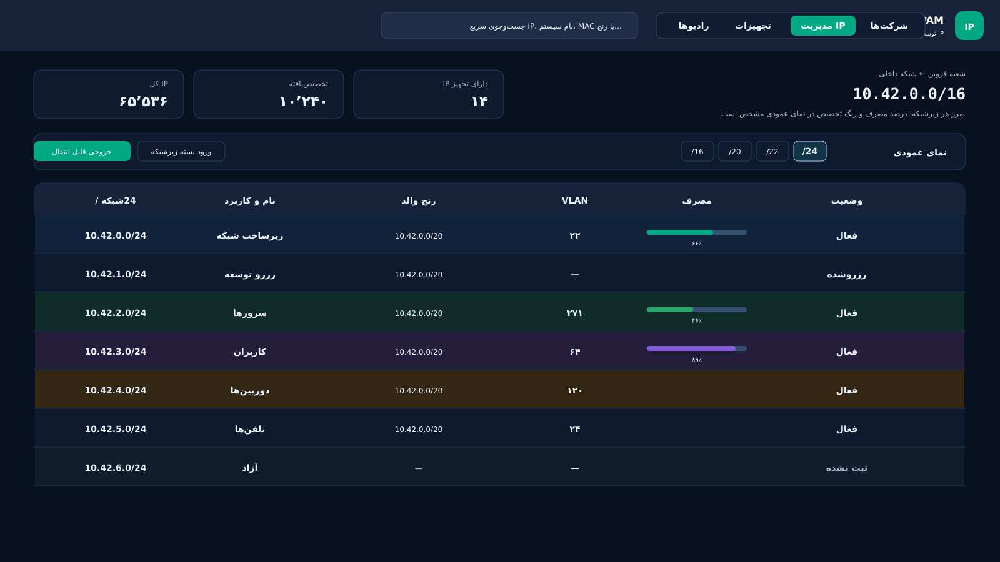
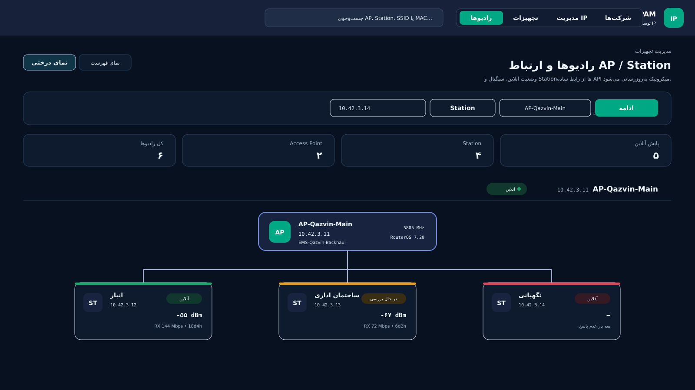
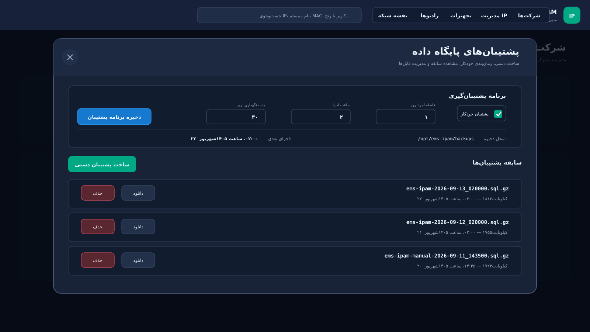
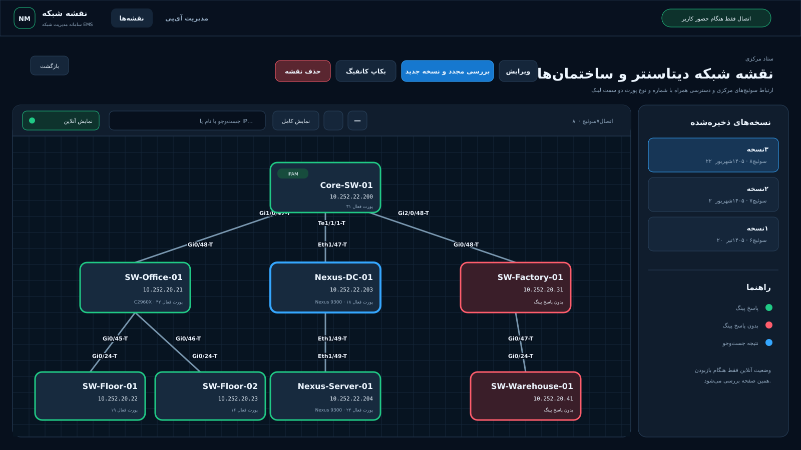

# سامانه مدیریت آی‌پی و نقشه شبکه EMS

سامانه‌ای یکپارچه و چندکاربره برای مدیریت شرکت‌ها، آدرس‌های شبکه، زیرشبکه‌ها، تجهیزات، ارتباط رادیوها، پشتیبان‌ها و نقشه فیزیکی سوئیچ‌ها.

رابط کاربری برنامه یکپارچه است، اما هر قابلیت در یک ماژول مستقل نگهداری می‌شود تا بتوان فقط همان ماژول را نصب یا به‌روزرسانی کرد. تمام ماژول‌ها از یک پایگاه داده مشترک استفاده می‌کنند.

**طراح و توسعه‌دهنده: ابراهیم مامانی**

مخزن رسمی:

[github.com/emsebi/EMS_IPAM](https://github.com/emsebi/EMS_IPAM)

## پیش‌نیاز مهم پیش از نصب

برای اجرای سامانه، نصب این دو مورد الزامی است:

- موتور داکر
- افزونه کامپوز داکر

نصب پورتینر الزامی نیست، اما برای مشاهده کانتینرها، گزارش‌ها، وضعیت سرویس‌ها و مدیریت ساده‌تر داکر قویاً پیشنهاد می‌شود.

اسکریپت پیش‌نیازها، داکر و کامپوز را از مخزن رسمی نصب می‌کند و پورتینر را نیز به‌صورت پیش‌فرض راه‌اندازی می‌کند. این اسکریپت برای اوبونتو و دبیان آماده شده است:

```bash
curl -fsSL https://raw.githubusercontent.com/emsebi/EMS_IPAM/main/install-prerequisites.sh | sudo bash
```

اگر پورتینر نیاز نیست:

```bash
curl -fsSL https://raw.githubusercontent.com/emsebi/EMS_IPAM/main/install-prerequisites.sh | sudo bash -s -- --without-portainer
```

اگر داکر، کامپوز یا پورتینر از قبل نصب باشند، اسکریپت اطلاعات و کانتینرهای موجود را حذف یا بازسازی نمی‌کند.

دسترسی به درگاه `9443` پورتینر را در فایروال فقط به شبکه مدیریتی یا آدرس‌های مجاز محدود کنید.

مستندات مرجع:

- [راهنمای رسمی نصب موتور داکر](https://docs.docker.com/engine/install/ubuntu/)
- [راهنمای رسمی نصب پورتینر](https://docs.portainer.io/start/install-ce/server/docker/linux)

## قابلیت‌های کلی سامانه

- تعریف چند شرکت، شعبه، سایت یا مشتری و ایجاد ساختار سازمانی
- تعریف چند فضای آدرس برای هر شرکت
- مدیریت زیرشبکه و آدرس از `/16` تا `/32`
- نمایش زیرشبکه‌ها به‌شکل جدول عمودی، کارت‌های تصویری و درخت قابل پیمایش
- ثبت نام، توضیح، کاربرد، رنگ، وضعیت، درگاه و شماره شبکه مجازی برای هر رنج
- ثبت مشخصات کامل هر آدرس شامل نام تجهیز، نشانی سخت‌افزاری، مدل، سریال، نسخه، مالک و محل نصب
- جست‌وجوی سریع بر اساس نام، آدرس، نشانی سخت‌افزاری، کاربر یا رنج
- مدیریت موجودی تجهیزات و پورت‌های فیزیکی
- ثبت ارتباط میان نقاط دسترسی و ایستگاه‌های رادیویی و نمایش نقشه ارتباط آن‌ها
- اتصال سریع به تجهیزات با کلاینت ویندوز و ابزارهای مجاز
- نقش‌های مدیر، ویرایشگر و مشاهده‌گر با محدودسازی دسترسی به شرکت یا رنج
- حذف نرم، سطل بازیافت، بازگردانی و کنترل حذف نهایی
- ورود و خروج بسته مستقل زیرشبکه برای انتقال اطلاعات
- پشتیبان‌گیری دستی و زمان‌بندی‌شده از پایگاه داده
- ماژول مستقل کشف و نمایش نقشه شبکه
- پوسته روشن و تاریک و رابط سازگار با نمایشگرهای مختلف

## نمای عمودی زیرشبکه‌ها

در نمای عمودی، مرز رنج‌ها، نام و کاربرد، شبکه والد، شماره شبکه مجازی، میزان مصرف و وضعیت هر زیرشبکه در یک جدول مشخص است. برای شبکه‌های بزرگ می‌توان بین سطوح مختلف حرکت کرد و تا آدرس `/32` پایین رفت.



## نقشه ارتباط رادیوها

رادیوهای نقطه دسترسی و ایستگاه به‌صورت دستی ثبت و ارتباط هر ایستگاه با نقطه دسترسی مربوط مشخص می‌شود. جست‌وجو، نمایش فهرستی و نمای درختی برای شبکه‌های دارای تعداد زیاد رادیو در دسترس است.

هیچ رمز تجهیزی ذخیره نمی‌شود و سامانه در نبود کاربر پایش یا اتصال خودکاری انجام نمی‌دهد.



## پشتیبان‌گیری و گزارش سابقه

مدیر می‌تواند از پایگاه داده پشتیبان دستی بسازد یا فاصله اجرا، ساعت و مدت نگهداری پشتیبان خودکار را تعیین کند. نام فایل، زمان ایجاد و حجم هر نسخه نمایش داده می‌شود و امکان دانلود یا حذف آن وجود دارد.



## ماژول نقشه شبکه

برای ساخت نقشه، کاربر نام نقشه، شرکت یا سایت و آدرس یک سوئیچ شروع را وارد می‌کند. اطلاعات اتصال فقط برای همان عملیات دریافت می‌شود. روش پیشنهادی اتصال، اس‌اس‌اچ است و تلنت فقط برای تجهیزات قدیمی در نظر گرفته شده است.

ماژول با استفاده از اطلاعات همسایگی، سوئیچ‌های متصل را به‌صورت بازگشتی پیدا می‌کند و ارتباط دقیق دو سمت هر لینک را نمایش می‌دهد:

- نام و آدرس مدیریتی هر سوئیچ
- شماره پورت دو سمت اتصال
- حالت کوتاه دسترسی یا ترانک کنار هر لینک
- کشف همسایه‌ها با پروتکل‌های سی‌دی‌پی و ال‌ال‌دی‌پی
- پشتیبانی از کاربر سطح ۱۵ یا رمز فعال‌سازی اختیاری
- زمان انتظار و تلاش مجدد قابل تنظیم برای سوئیچ‌های کند
- محدودیت تعداد تجهیزات و تعداد اتصال هم‌زمان

نقشه به‌صورت درختی چیده می‌شود و امکان بزرگ‌نمایی، کوچک‌نمایی، جابه‌جایی، نمایش کامل و جست‌وجو بر اساس نام یا آدرس وجود دارد. گزینه نمایش آنلاین فقط هنگام بازبودن صفحه از سوئیچ‌ها پینگ می‌گیرد؛ سبز نشان‌دهنده پاسخ و قرمز نشان‌دهنده نبود پاسخ است.

هر بار بررسی مجدد، یک نسخه تاریخی مستقل با تاریخ و ساعت ایجاد می‌کند. بنابراین تغییر توپولوژی در روزها یا ماه‌های بعد قابل مشاهده است و نسخه‌های قبلی تغییر نمی‌کنند. نقشه و نسخه‌های حذف‌شده ابتدا به سطل بازیافت می‌روند و امکان بازگردانی دارند.

با انتخاب هر سوئیچ، صفحه جزئیات آن در یک برگه جدید باز می‌شود و موارد زیر را نمایش می‌دهد:

- کاشی پورت‌ها با شماره، حالت دسترسی یا ترانک و شبکه مجازی
- رنگ متفاوت برای پورت فعال، آزاد، خاموش مدیریتی یا دارای خطا
- مدل، شماره سریال، سیستم‌عامل، نسخه و مدت کارکرد
- فهرست شبکه‌های مجازی و تعداد پورت‌های فعال یا آزاد
- به‌روزرسانی دستی اطلاعات فقط همان سوئیچ

در بخش پشتیبان کانفیگ می‌توان همه سوئیچ‌ها یا موارد دلخواه را انتخاب کرد. نسخه پاک‌سازی‌شده برای مشاهده، دانلود، حذف، بازیابی و مقایسه دو نسخه نگهداری می‌شود. کانفیگ کامل فقط به‌صورت زنده دانلود می‌شود و روی سرور باقی نمی‌ماند.



## سیاست امنیت اطلاعات تجهیزات

- رمز ورود، رمز فعال‌سازی و رمز تجهیزات میکروتیک در پایگاه داده یا فایل تنظیمات ذخیره نمی‌شود.
- اطلاعات ورود فقط تا پایان عملیات دستی در حافظه همان عملیات قرار می‌گیرد.
- با پایان کار، توقف عملیات، خروج کاربر یا بسته‌شدن صفحه، اطلاعات ورود پاک می‌شود.
- سامانه در نبود کاربر هیچ اتصال یا پایش خودکاری روی تجهیزات انجام نمی‌دهد.
- خطوط حساس کانفیگ پیش از ذخیره نسخه پشتیبان حذف می‌شوند.
- کانفیگ کامل فقط به‌صورت زنده تحویل کاربر می‌شود و روی سرور ذخیره نمی‌شود.

## نصب سامانه

پس از نصب پیش‌نیازها، دستور زیر را اجرا کنید:

```bash
curl -fsSL https://raw.githubusercontent.com/emsebi/EMS_IPAM/main/install.sh | sudo bash
```

برای نصب تازه گزینه `1` و برای ارتقای نصب قبلی گزینه `2` را انتخاب کنید. در نصب تازه، فعال‌کردن هر ماژول از کاربر پرسیده می‌شود. پایگاه داده فقط یک‌بار ساخته می‌شود و تمام ماژول‌های انتخاب‌شده از همان پایگاه داده استفاده می‌کنند.

نشانی اصلی سامانه:

```text
http://SERVER-IP:PORT
```

نشانی ماژول نقشه شبکه:

```text
http://SERVER-IP:PORT/network-map/
```

نشانی پورتینر در نصب پیش‌فرض:

```text
https://SERVER-IP:9443
```

## انتخاب و به‌روزرسانی ماژول‌ها

فایل `modules.conf` فهرست مرکزی ماژول‌هاست. هر ماژول یک نصب‌کننده مستقل دارد و می‌تواند بدون حذف اطلاعات غیرفعال یا دوباره فعال شود.

برای به‌روزرسانی فقط ماژول نقشه شبکه:

```bash
curl -fsSL https://raw.githubusercontent.com/emsebi/EMS_IPAM/main/modules/network-map/install.sh | sudo bash -s -- update
```

این دستور فقط تصویر ماژول نقشه شبکه را دوباره می‌سازد؛ مدیریت آی‌پی و پایگاه داده بازسازی نمی‌شوند.

## محل پشتیبان‌های پایگاه داده

```text
/opt/ems-ipam/backups
```

پشتیبان خودکار پایگاه داده هیچ ارتباطی با تجهیزات شبکه برقرار نمی‌کند.

## کلاینت ویندوز

[دانلود کلاینت ویندوز نسخه ۰.۶](https://github.com/emsebi/EMS_IPAM/raw/refs/heads/main/docker-app/public/downloads/EMS-IPAM-Windows-Client-v0.6.0.zip)

یا پس از نصب سامانه:

```text
http://SERVER-IP:PORT/client.html
```

پس از استخراج فایل، `Install.cmd` را اجرا کنید. رمز در برنامه مقصد مانند پوتی، اوپن‌اس‌اس‌اچ، وین‌باکس یا ریموت دسکتاپ وارد می‌شود و از مرورگر ارسال نمی‌شود.

## اجرای آزمون‌ها

```bash
cd docker-app && npm test
cd ../modules/network-map && npm test
```
