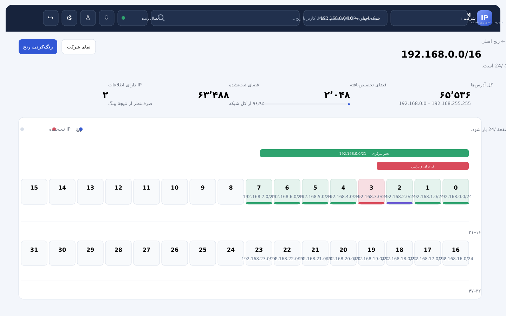

# EMS IPAM

سامانهٔ چندکاربره و کانتینری برای مدیریت تصویری شبکه و فضای آدرس.



## نصب

پیش‌نیاز: Linux دارای Docker Engine، Docker Compose، `curl`، `tar` و `ss`.

```bash
curl -fsSL https://raw.githubusercontent.com/emssebi/EMS_IPAM/main/install.sh | sudo bash
```

نصب‌کننده رمز دیتابیس، نام کاربری و رمز مدیر، پورت پنل و وضعیت HTTPS را می‌پرسد. اگر پورت انتخابی اشغال باشد، نصب پیش از ساخت کانتینرها متوقف می‌شود.

## امکانات

- نمایش گرافیکی رنج‌ها، زیرشبکه‌ها و IPها
- شرکت‌ها، کاربران و سطح دسترسی
- ثبت اطلاعات و پورت‌های اختصاصی هر IP
- پینگ و نمایش لحظه‌ای تغییرات
- PostgreSQL و اجرای کانتینری با Docker Compose
- کلاینت ویندوز برای Winbox، RDP، PuTTY و VNC

فایل `portainer-stack.yml` نیز برای ساخت Stack در Portainer آماده است.
