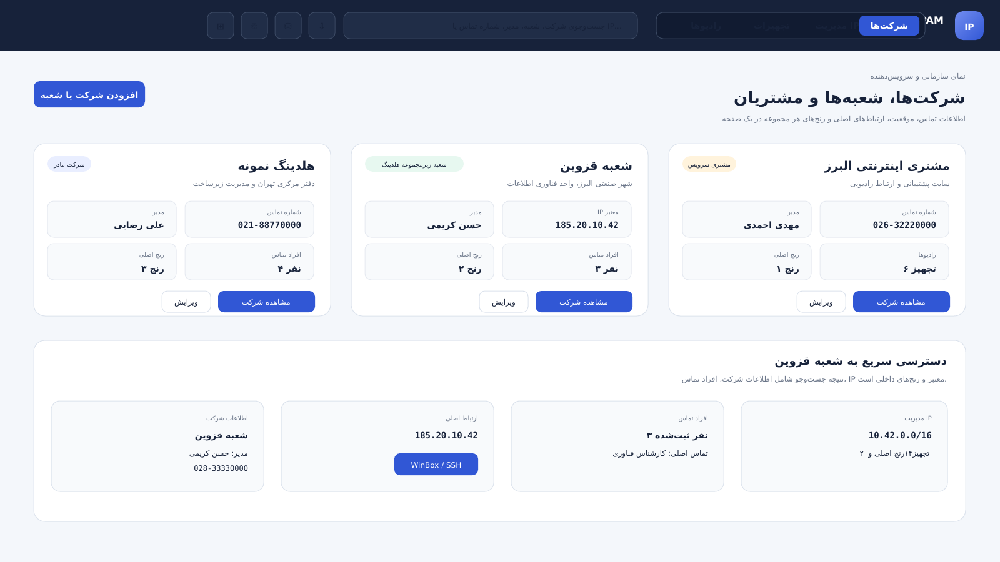
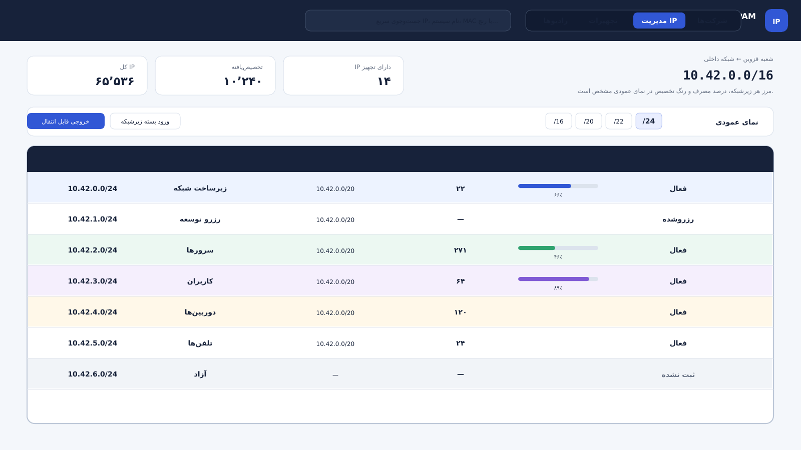
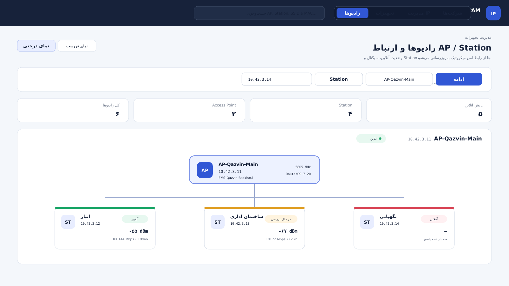
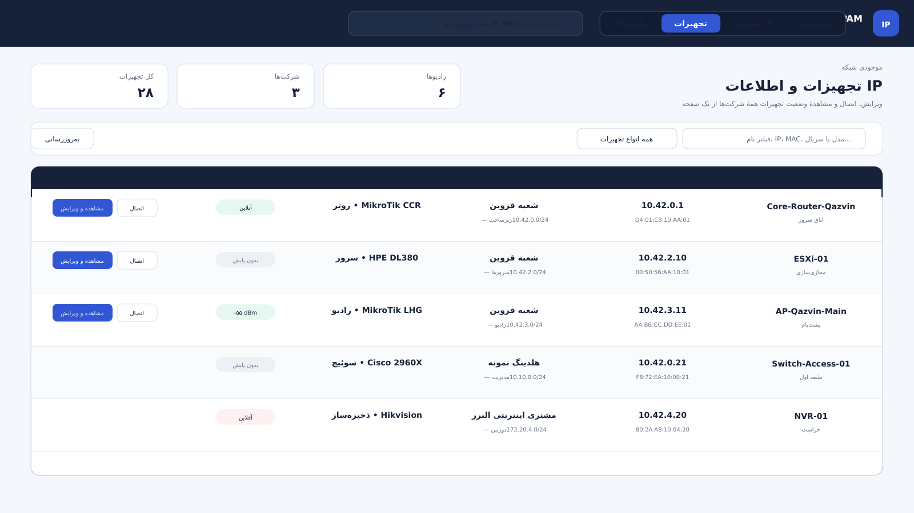

# سامانه توسعه و مدیریت IP

سامانهٔ متن‌باز و چندکاربره برای مدیریت آدرس‌های شبکه، شرکت‌ها و شعبه‌ها، تجهیزات، رادیوها و ارتباط‌های سازمانی.

این ساختار با توجه به نیازهای شبکه‌های سازمانی و سرویس‌دهندگان اینترنت طراحی و توسعه داده شده است؛ امیدوارم در سامان‌دهی منابع IP، مستندسازی شبکه و پیشبرد اهداف سازمان‌ها مؤثر باشد.

**طراح و توسعه‌دهنده: ابراهیم مامانی**

اگر این پروژه برایتان مفید است، از صفحهٔ [EMS IPAM در GitHub](https://github.com/emsebi/EMS_IPAM) بازدید کنید و با ثبت Star از توسعهٔ آن حمایت کنید.

## تصاویر برنامه

### مدیریت شرکت‌ها و شعبه‌ها



### مدیریت IP و زیرشبکه‌ها



### مدیریت رادیوها و پایش لینک‌ها



### مدیریت تجهیزات



## امکانات اصلی

- ساختار سلسله‌مراتبی سازمان، شرکت، مشتری و شعبه با جست‌وجوی سریع فارسی
- ثبت آدرس، کد پستی، تلفن، مدیر، موقعیت نقشه، اعضا، راه‌های تماس و یادداشت آزاد
- ثبت چند ارتباط معتبر برای هر شعبه و اتصال با WinBox، RDP، SSH، VNC، HTTP و HTTPS
- مدیریت رنج‌های اصلی از `/16` تا `/24` و تقسیم‌بندی زیرشبکه‌ها تا `/32`
- جلوگیری از تخصیص خارج از رنج والد و کنترل هم‌پوشانی رنج‌ها
- گزارش تعداد و درصد IPهای آزاد، مصرف‌شده، رزروشده و نزدیک به تکمیل ظرفیت
- مدیریت تجهیزات، پورت‌ها، لینک‌ها و توپولوژی شبکه
- مدیریت رادیوهای AP و Station و نمایش وضعیت آنلاین، سیگنال، نرخ ارتباط و مدت اتصال
- پایش امن MikroTik RouterOS v7 با REST روی HTTPS و RouterOS v6 با API-SSL
- دسترسی چندکاربره در سطح شرکت، شعبه یا فضای آدرس‌دهی
- خروجی و ورود مستقل هر زیرشبکه برای انتقال به نصب دیگر سامانه، بدون انتقال رمزها
- حذف نرم، سطل بازیافت، بازگردانی اطلاعات و پاک‌سازی کنترل‌شده
- هشدار تغییرات ذخیره‌نشده، مسیر قابل بازگشت و پشتیبانی از دکمهٔ عقب مرورگر
- پشتیبان‌گیری دستی و خودکار با بازه، ساعت، محل و مدت نگهداری قابل تنظیم
- رابط واکنش‌گرا، نمای روشن و تیره و خوانایی مناسب در نمایش‌های بزرگ و کوچک

## نصب روی سرور

پیش‌نیاز، یک سرور Linux دارای Docker Engine، Docker Compose، `curl`، `tar` و `ss` است.

```bash
curl -fsSL https://raw.githubusercontent.com/emsebi/EMS_IPAM/main/install.sh | sudo bash
```

اسکریپت نصب، نام کاربری مدیر و یک رمز حداقل ۱۲ کاراکتری را از شما می‌گیرد. برنامه رمز پیش‌فرض قابل حدس ندارد. منوی نصب شامل نصب، به‌روزرسانی، پشتیبان‌گیری، بازیابی و حذف است و اشغال‌بودن پورت را پیش از اجرا بررسی می‌کند.

فایل `portainer-stack.yml` نیز برای ساخت Stack در Portainer آماده است.

## پشتیبان‌گیری خودکار

مدیر سامانه از بخش «پشتیبان‌ها» می‌تواند این موارد را تعیین کند:

- فعال یا غیرفعال‌بودن پشتیبان خودکار
- فاصلهٔ پشتیبان‌گیری برحسب روز
- ساعت اجرای پشتیبان
- تعداد روزهای نگهداری فایل‌ها

مسیر پیش‌فرض پشتیبان روی سرور:

```text
/opt/ems-ipam/backups
```

این مسیر با متغیر `EMS_BACKUP_PATH` قابل تغییر است و داخل همان صفحهٔ تنظیمات نیز نمایش داده می‌شود.

## انتقال یک زیرشبکه بین دو سامانه

از صفحهٔ زیرشبکه گزینهٔ «خروجی زیرشبکه» را انتخاب کنید. فایل با قالب زیر ساخته می‌شود:

```text
EMS-IPAM-SUBNET (*.emsipam.json)
```

در سامانهٔ مقصد، گزینهٔ «ورود اطلاعات» را بزنید و فایل را انتخاب کنید. رنج، IPها، تجهیزات، پورت‌ها و رابطهٔ رادیوها منتقل می‌شوند؛ رمزهای اتصال عمداً داخل فایل خروجی قرار نمی‌گیرند. در صورت تداخل می‌توان رکوردهای موجود را حفظ یا جایگزین کرد.

## کلاینت اتصال ویندوز

دانلود مستقیم از GitHub:

[دانلود EMS IPAM Windows Client v0.5.0](https://github.com/emsebi/EMS_IPAM/raw/refs/heads/main/docker-app/public/downloads/EMS-IPAM-Windows-Client-v0.5.0.zip)

پس از نصب سرویس وب نیز صفحهٔ راهنما و دانلود از این نشانی در دسترس است:

```text
http://SERVER-IP:PORT/client.html
```

نشانی مستقیم فایل روی سرویس نصب‌شده:

```text
http://SERVER-IP:PORT/downloads/EMS-IPAM-Windows-Client-v0.5.0.zip
```

فایل فشرده را باز کنید و روی `Install.cmd` دوبار کلیک کنید. نصب برای همان کاربر ویندوز انجام می‌شود و معمولاً دسترسی Administrator لازم ندارد. کلاینت برنامه‌های نصب‌شده را از رجیستری استاندارد App Paths، مسیر سیستم و محل‌های رایج پیدا می‌کند؛ اگر برنامه‌ای پیدا نشود، فقط بار اول فایل اجرایی آن را انتخاب می‌کنید.

نام کاربری، آدرس و پورت به برنامهٔ مقصد منتقل می‌شود، اما رمز عبور هرگز داخل لینک مرورگر قرار نمی‌گیرد. توضیحات کامل در [راهنمای کلاینت ویندوز](docs/WINDOWS-CLIENT-FA.md) قرار دارد.

## پایش امن رادیوهای MikroTik

برای RouterOS v7، روش پیشنهادی `REST / HTTPS` روی پورت ۴۴۳ است. برای RouterOS v6، روش `API-SSL` روی پورت ۸۷۲۹ در نظر گرفته شده است. در فرم تجهیز، مشخصات اتصال و CA گواهی را ثبت کنید و از گزینهٔ «ساخت اسکریپت اتصال امن» استفاده کنید.

سامانه کاربر اختصاصی خواندنی می‌سازد، دسترسی سرویس را به IP سرور محدود می‌کند و اعتبار گواهی TLS را نادیده نمی‌گیرد. راهنمای کامل در [آموزش اتصال امن MikroTik](docs/MIKROTIK-FA.md) قرار دارد.

مراجع رسمی: [MikroTik REST API](https://help.mikrotik.com/docs/spaces/ROS/pages/47579162/REST%20API)، [MikroTik API](https://help.mikrotik.com/docs/spaces/ROS/pages/47579160/API)، [MikroTik WinBox](https://help.mikrotik.com/docs/spaces/ROS/pages/328129/WinBox) و [Microsoft Remote Desktop](https://learn.microsoft.com/en-us/windows-server/administration/windows-commands/mstsc).

## به‌روزرسانی و آزمون

برای به‌روزرسانی، دوباره اسکریپت نصب را اجرا و گزینهٔ Update را انتخاب کنید. پیش از تغییر، پشتیبان تهیه می‌شود و داده‌های نسخهٔ قبلی حفظ می‌گردند.

آزمون‌های پروژه:

```bash
cd docker-app
npm test
```

نتیجه و محدودهٔ آزمون نسخه در [گزارش آزمون ۰.۵.۰](docs/TEST-REPORT-FA.md) ثبت شده است.
