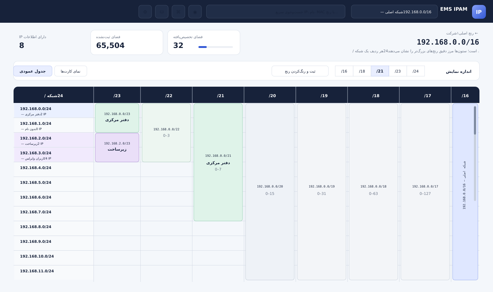

# EMS IPAM

سامانهٔ چندکاربره و کانتینری برای مدیریت تصویری IP، زیرشبکه، رادیو و توپولوژی شبکه.



## نصب

پیش‌نیاز: Linux دارای Docker Engine، Docker Compose، `curl`، `tar` و `ss`.

```bash
curl -fsSL https://raw.githubusercontent.com/emsebi/EMS_IPAM/main/install.sh | sudo bash
```

منوی انگلیسی اسکریپت شامل نصب، به‌روزرسانی، پشتیبان‌گیری، بازیابی و دو نوع حذف است. اگر پورت انتخابی اشغال باشد، نصب متوقف می‌شود.

## امکانات

- جدول عمودی یکسان برای همهٔ رنج‌های /16 تا /24 و نمایش مرحله‌ای جدول‌های /24
- نمایش کامل زیرشبکه‌ها تا /32 در نمای تصویری و درختی قابل اسکرول
- ایجاد، ویرایش و حذف شرکت، شبکه، زیرشبکه، کاربر و اطلاعات هر IP
- دسترسی کاربر در سطح شرکت کامل یا شبکه‌های انتخابی
- محافظت از آخرین مدیر فعال سامانه
- ثبت تجهیزات، رادیوهای AP و Station، درخت ارتباط رادیویی، اتصال‌های سریع و رمز رمزگذاری‌شده
- نقشهٔ توپولوژی تجهیزات، پورت‌ها و لینک‌های فیزیکی
- ساخت، دانلود و حذف پشتیبان از مرورگر در مسیر ثابت سرور
- PostgreSQL و اجرای کانتینری با Docker Compose
- کلاینت اختیاری ویندوز برای WinBox، RDP، PuTTY و VNC

مسیر پیش‌فرض پشتیبان روی سرور `/opt/ems-ipam/backups` است و از فایل `.env` قابل تغییر است. فایل `portainer-stack.yml` نیز برای ساخت Stack در Portainer آماده است.

ساخته‌شده توسط **EMSebi** — `EMSebi@Gmail.Com` — Telegram: `@EMSebi`
