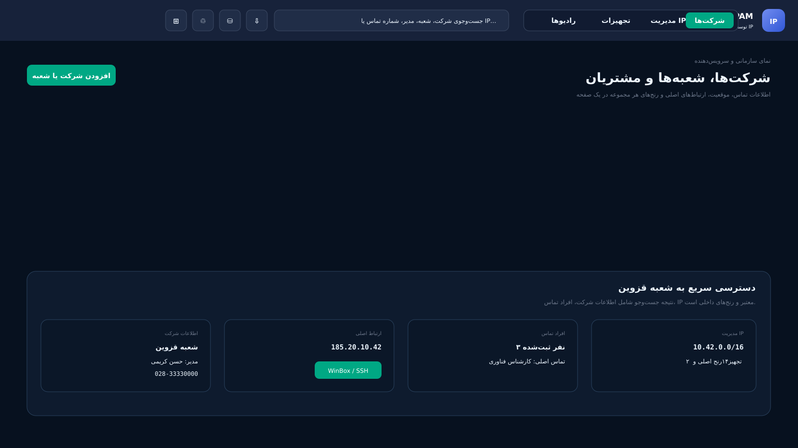
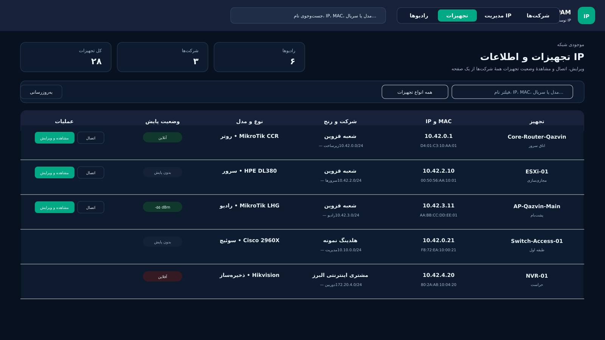

# سامانه مدیریت IP و نقشه شبکه EMS

سامانه چندکاربره برای مدیریت آدرس‌ها، شرکت‌ها، تجهیزات و نقشه ارتباط سوئیچ‌ها. رابط کاربری یکپارچه است، اما هر قابلیت در ماژول مستقل نگهداری و به‌روزرسانی می‌شود.

**طراح و توسعه‌دهنده: ابراهیم مامانی**

مخزن رسمی: [github.com/emsebi/EMS_IPAM](https://github.com/emsebi/EMS_IPAM)

## تصاویر مدیریت IP






## امکانات اصلی

- مدیریت شرکت، شعبه، فضای آدرس، زیرشبکه و IP از `/16` تا `/32`
- مدیریت موجودی تجهیزات، پورت‌ها، رادیوهای AP و Station و روش‌های اتصال
- دسترسی مدیر، ویرایشگر و مشاهده‌گر در سطح شرکت یا فضای آدرس
- حذف نرم، سطل بازیافت، بازیابی و کنترل حذف نهایی
- پشتیبان‌گیری از پایگاه داده و ورود/خروج مستقل زیرشبکه بدون رمز تجهیزات
- اتصال ویندوز به WinBox، RDP، SSH، Telnet و VNC بدون قراردادن رمز در لینک
- ماژول مستقل نقشه شبکه با همان ورود کاربران و همان پایگاه داده

## ماژول نقشه شبکه

- کشف بازگشتی همسایه‌ها با CDP و LLDP از یک IP شروع
- اتصال پیش‌فرض SSH و Telnet فقط برای تجهیزات قدیمی
- پشتیبانی از کاربر سطح ۱۵ یا رمز اختیاری `enable`
- مهلت قابل تنظیم برای سوئیچ‌های کند، تلاش مجدد و محدودیت تعداد تجهیزات
- نمایش نام و IP سوئیچ، پورت دو سمت لینک و حالت کوتاه Access/Trunk
- چیدمان درختی، زوم، جابه‌جایی، نمایش کامل و جست‌وجوی نام/IP
- پینگ اختیاری فقط هنگام بازبودن صفحه؛ بدون پایش خودکار
- ذخیره نسخه‌های تاریخی مستقل نقشه و بازیابی نسخه‌های حذف‌شده
- صفحه جدا برای هر سوئیچ، کاشی پورت‌ها، مدل، سریال، نسخه و VLANها
- به‌روزرسانی دستی فقط یک سوئیچ
- بکاپ گروهی کانفیگ، مشاهده، دانلود، حذف/بازیابی و مقایسه دو نسخه

## سیاست امنیت رمز تجهیزات

- هیچ رمز ورود، رمز `enable` یا رمز میکروتیک در پایگاه داده یا فایل تنظیمات ذخیره نمی‌شود.
- رمز فقط در حافظه همان عملیات دستی قرار می‌گیرد و پس از پایان، توقف، خروج یا بسته‌شدن صفحه پاک می‌شود.
- سامانه در نبود کاربر هیچ اتصال یا پایش خودکاری روی تجهیزات انجام نمی‌دهد.
- نسخه ذخیره‌شده کانفیگ پیش از ثبت، به‌صورت سخت‌گیرانه از خطوط حساس پاک‌سازی می‌شود.
- کانفیگ کامل فقط به‌صورت زنده دانلود می‌شود و روی سرور ذخیره نمی‌شود.
- نسخه ۰.۶ هنگام ارتقا، داده‌های رمز قدیمی تجهیزات را برای همیشه از پایگاه داده پاک می‌کند.

## نصب

ابتدا Docker Engine، افزونه Docker Compose و در صورت نیاز Portainer را روی سرور نصب کنید. سپس اجرا کنید:

```bash
curl -fsSL https://raw.githubusercontent.com/emsebi/EMS_IPAM/main/install.sh | sudo bash
```

برای نصب تازه گزینه `1` و برای ارتقای نصب قبلی گزینه `2` را انتخاب کنید. نصب تازه درباره فعال‌کردن هر ماژول سؤال می‌کند. پایگاه داده فقط یک‌بار ساخته می‌شود و همه ماژول‌ها از همان پایگاه داده استفاده می‌کنند.

نشانی سامانه:

```text
http://SERVER-IP:PORT
```

نشانی نقشه شبکه:

```text
http://SERVER-IP:PORT/network-map/
```

## انتخاب ماژول‌ها

فایل `modules.conf` فهرست مرکزی ماژول‌هاست و هر ماژول یک خط مستقل دارد. گزینه `7` در نصب‌کننده برای فعال یا غیرفعال‌کردن ماژول‌هاست. غیرفعال‌کردن ماژول، داده‌های آن را حذف نمی‌کند.

## به‌روزرسانی فقط نقشه شبکه

پس از آنکه نسخه کامل ۰.۶ حداقل یک‌بار نصب یا ارتقا داده شد، برای نسخه‌های بعدی نقشه فقط این دستور را اجرا کنید:

```bash
curl -fsSL https://raw.githubusercontent.com/emsebi/EMS_IPAM/main/modules/network-map/install.sh | sudo bash -s -- update
```

این دستور فقط تصویر Docker ماژول نقشه را دوباره می‌سازد. تصویر مدیریت IP و پایگاه داده بازسازی نمی‌شوند.

## پشتیبان‌گیری

پشتیبان پایگاه داده از پنل مدیر یا گزینه `3` نصب‌کننده ساخته می‌شود. مسیر پیش‌فرض:

```text
/opt/ems-ipam/backups
```

پشتیبان خودکار پایگاه داده ارتباطی با تجهیزات ندارد. آرشیوهای ساخته‌شده با نسخه‌های قدیمی ممکن است هنوز رمزهای رمزگذاری‌شده قدیمی را داشته باشند؛ پس از اطمینان از ارتقا، آن‌ها را طبق سیاست سازمان بررسی کنید.

## کلاینت ویندوز

[دانلود EMS IPAM Windows Client v0.6.0](https://github.com/emsebi/EMS_IPAM/raw/refs/heads/main/docker-app/public/downloads/EMS-IPAM-Windows-Client-v0.6.0.zip)

یا پس از نصب:

```text
http://SERVER-IP:PORT/client.html
```

فایل را استخراج و `Install.cmd` را اجرا کنید. رمز در خود PuTTY، OpenSSH، WinBox یا برنامه مقصد وارد می‌شود و از مرورگر ارسال نمی‌شود.

## آزمون

```bash
cd docker-app && npm test
cd ../modules/network-map && npm test
```
