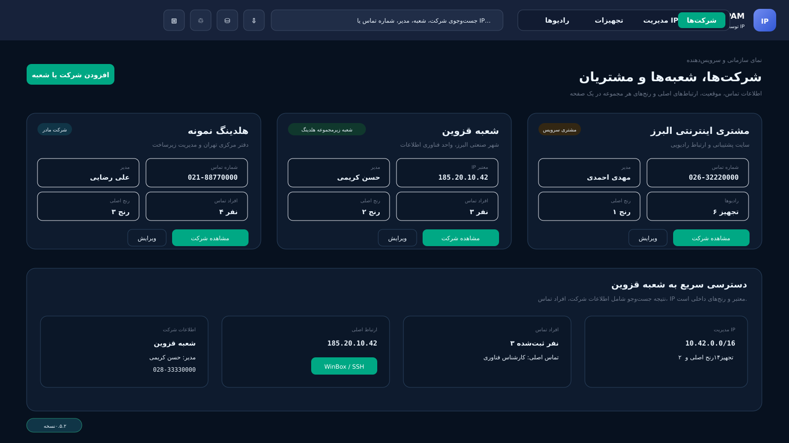
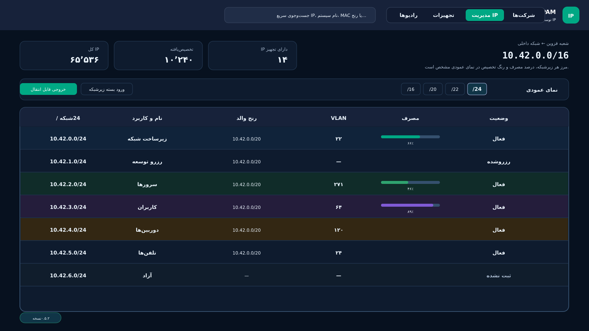
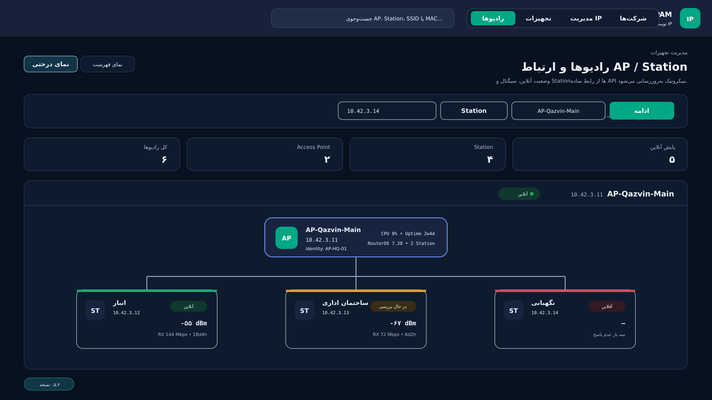
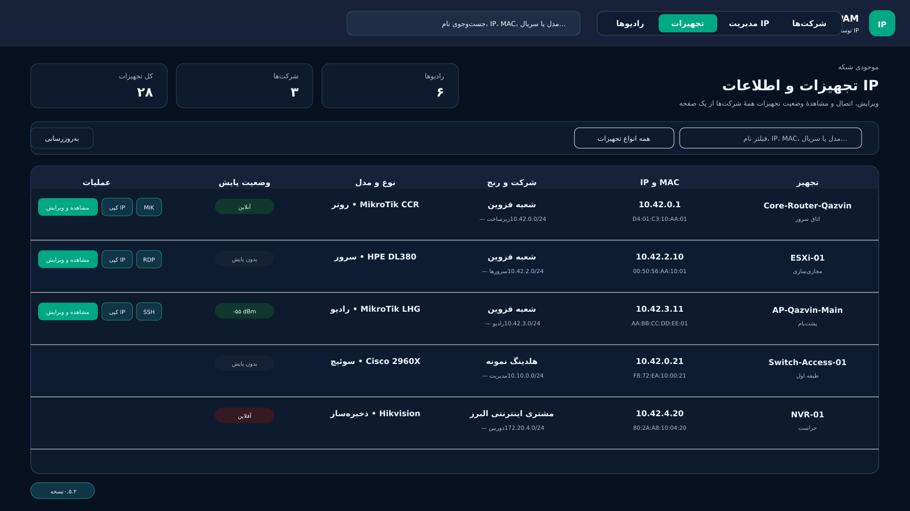

# سامانه توسعه و مدیریت IP

سامانهٔ متن‌باز و چندکاربره برای مدیریت آدرس‌های شبکه، شرکت‌ها و شعبه‌ها، تجهیزات، رادیوها و ارتباط‌های سازمانی.

این ساختار با توجه به نیازهای شبکه‌های سازمانی و سرویس‌دهندگان اینترنت طراحی و توسعه داده شده است؛ امیدوارم در سامان‌دهی منابع IP، مستندسازی شبکه و پیشبرد اهداف سازمان‌ها مؤثر باشد.

**طراح و توسعه‌دهنده: ابراهیم مامانی**

اگر این پروژه برایتان مفید است، از صفحهٔ [EMS IPAM در GitHub](https://github.com/emsebi/EMS_IPAM) بازدید کنید و با ثبت Star از توسعهٔ آن حمایت کنید.

## تصاویر برنامه

### مدیریت شرکت‌ها و شعبه‌ها



### مدیریت IP و زیرشبکه‌ها



### مدیریت رادیوها و پایش لینک‌ها



### مدیریت تجهیزات



## امکانات اصلی

- ساختار سلسله‌مراتبی سازمان، شرکت، مشتری و شعبه با جست‌وجوی سریع فارسی
- ثبت آدرس، کد پستی، تلفن، مدیر، موقعیت نقشه، اعضا، راه‌های تماس و یادداشت آزاد
- ثبت چند ارتباط معتبر برای هر شعبه و اتصال با WinBox، RDP، SSH، VNC، HTTP و HTTPS
- دکمهٔ مستقیم «کپی IP» و نمایش فقط ابزارهای اتصالی که برای همان IP تعریف شده‌اند
- مدیریت رنج‌های اصلی از `/16` تا `/24` و تقسیم‌بندی زیرشبکه‌ها تا `/32`
- محاسبهٔ خودکار Gateway بر اساس Network انتخاب‌شده
- جلوگیری از تخصیص خارج از رنج والد و کنترل هم‌پوشانی رنج‌ها
- گزارش تعداد و درصد IPهای آزاد، مصرف‌شده، رزروشده و نزدیک به تکمیل ظرفیت
- مدیریت تجهیزات، پورت‌ها، لینک‌ها و توپولوژی فعلی شبکه
- مدیریت رادیوهای AP و Station و نمایش وضعیت، Identity، مدل، نسخه، Uptime، CPU، حافظه، سیگنال و نرخ ارتباط
- جست‌وجوی AP هنگام اتصال Station
- پایش سادهٔ MikroTik با API و نام کاربری/رمز دلخواه، بدون نیاز به Certificate
- بکاپ کانفیگ MikroTik با SSH و خروجی حساس، بدون ذخیره‌شدن رمز ورود دستگاه
- گزارش مستقل آنلاین‌بودن IP تکی یا Subnet در ساعت تعیین‌شده و نگهداری نتایج ۱۰ روز
- تغییر فونت و اندازهٔ نوشته از تنظیمات مدیر
- ویرایش پشت‌سرهم IPها با «قبلی»، «بعدی»، «ذخیره» و «ذخیره و بستن»
- دسترسی چندکاربره در سطح شرکت، شعبه یا فضای آدرس‌دهی
- خروجی و ورود مستقل هر زیرشبکه برای انتقال به نصب دیگر سامانه، بدون انتقال رمزها
- حذف نرم، سطل بازیافت، بازگردانی اطلاعات و پاک‌سازی کنترل‌شده
- هشدار تغییرات ذخیره‌نشده، مسیر قابل بازگشت و پشتیبانی از دکمهٔ عقب مرورگر
- پشتیبان‌گیری کامل دیتابیس به‌صورت دستی یا خودکار با زمان و محل قابل تنظیم
- تم نئون تیره به‌صورت پیش‌فرض و جدول‌های تیره و خوانا
- رابط نسخه‌دار برای اتصال پروژهٔ مستقل «نقشه شبکه» در آینده

## پیش‌نیازهای نصب

پیش از نصب EMS IPAM، ابتدا **Docker Engine** و افزونهٔ **Docker Compose** را روی سرور نصب و اجرا کنید. اگر نصب گرافیکی را انتخاب می‌کنید، **Portainer** نیز باید از قبل نصب، اجرا و در دسترس باشد.

حداقل پیش‌نیازهای روش خط فرمان:

- سرور Linux
- Docker Engine فعال
- Docker Compose نسخهٔ ۲
- ابزارهای `curl`، `tar` و `ss`

پیش‌نیازهای روش Portainer:

- Docker Engine فعال
- Portainer نصب‌شده و قابل ورود

خود EMS IPAM نصب‌کنندهٔ Docker یا Portainer نیست و باید این دو بخش پیش از شروع آماده باشند.

## نصب با خط فرمان

پس از آماده‌کردن پیش‌نیازها، دستور زیر را اجرا کنید:

```bash
curl -fsSL https://raw.githubusercontent.com/emsebi/EMS_IPAM/main/install.sh | sudo bash
```

اسکریپت نصب، نام کاربری مدیر و یک رمز دلخواهِ غیرخالی را دریافت می‌کند و طول مشخصی را تحمیل نمی‌کند. منو شامل نصب، به‌روزرسانی، پشتیبان‌گیری، بازیابی و حذف است و اشغال‌بودن پورت را پیش از اجرا بررسی می‌کند.

## نصب با Portainer

بعد از نصب Docker و Portainer:

1. مسیر بکاپ را یک‌بار روی سرور آماده کنید:

   ```bash
   sudo mkdir -p /opt/ems-ipam/backups
   sudo chown -R 1000:1000 /opt/ems-ipam/backups
   ```

2. فایل `portainer-stack.yml` را باز کنید.
3. در Portainer وارد بخش `Stacks` شوید و یک Stack جدید بسازید.
4. محتوای فایل را در Web editor قرار دهید.
5. متغیرهای فایل `.env.example` را با مقادیر دلخواه خود تعریف کنید.
6. Stack را Deploy کنید.
7. پنل را از نشانی `http://SERVER-IP:PORT` باز کنید.

رمز مدیر و دیتابیس می‌تواند هر مقدار غیرخالی دلخواه باشد. بهتر است مقدار `EMS_SECRET_KEY` یک رشتهٔ تصادفی ۶۴ کاراکتری باشد؛ نصب‌کنندهٔ خط فرمان آن را خودکار می‌سازد.

## پشتیبان‌گیری کامل سامانه

مدیر از بخش «پشتیبان‌ها» می‌تواند فعال‌بودن، فاصلهٔ روزها، ساعت اجرا و مدت نگهداری پشتیبان دیتابیس را تعیین کند.

مسیر پیش‌فرض روی سرور:

```text
/opt/ems-ipam/backups
```

این مسیر با متغیر `EMS_BACKUP_PATH` قابل تغییر است و در همان صفحه نیز نمایش داده می‌شود.

## بکاپ کانفیگ MikroTik

برای هر IP تجهیز، IP معتبر شرکت یا دستگاهی که دستی وارد می‌شود، امکان افزودن به فهرست بکاپ وجود دارد. در فهرست، IP، پورت SSH، نام کاربری و نسخهٔ RouterOS نگهداری می‌شود؛ **رمز عبور در هیچ بخشی ذخیره نمی‌شود** و فقط هنگام اجرای بکاپ در کادر خالی وارد می‌گردد.

سامانه ابتدا Identity و نسخه را می‌خواند و سپس خروجی متنی قابل بازیابی با پسوند `.rsc` می‌گیرد. نام فایل شامل نام دستگاه و تاریخ شمسی است. فایل را می‌توان مشاهده، کپی یا دانلود کرد. دستگاه موفق از انتخاب خارج می‌شود و دستگاه ناموفق برای تلاش بعدی انتخاب‌شده باقی می‌ماند.

راهنمای کاربر و تنظیم MikroTik در [راهنمای بکاپ کانفیگ](docs/MIKROTIK-BACKUP-FA.md) قرار دارد.

## گزارش مستقل آنلاین‌بودن

در تب «گزارش آنلاین‌بودن» می‌توان یک IP یا یک Subnet تا حداکثر ۴۰۹۶ آدرس را ثبت و ساعت بررسی روزانه را تعیین کرد. برای هر IP تا سه پینگ فرستاده می‌شود و نتایج آنلاین و بدون پاسخ، همراه نام ثبت‌شدهٔ تجهیز و تاریخ شمسی، تا ۱۰ روز نگهداری می‌شوند. خروجی CSV نیز در دسترس است.

این گزارش مستقل از پایش رادیوهاست و فقط پاسخ پینگ را ثبت می‌کند.

## انتقال یک زیرشبکه بین دو سامانه

از صفحهٔ زیرشبکه گزینهٔ «خروجی زیرشبکه» را انتخاب کنید. فایل با قالب زیر ساخته می‌شود:

```text
EMS-IPAM-SUBNET (*.emsipam.json)
```

در سامانهٔ مقصد، گزینهٔ «ورود اطلاعات» را بزنید و فایل را انتخاب کنید. رنج، IPها، تجهیزات، پورت‌ها و رابطهٔ رادیوها منتقل می‌شوند؛ رمزهای اتصال عمداً داخل فایل خروجی قرار نمی‌گیرند.

## کلاینت اتصال ویندوز

دانلود مستقیم از GitHub:

[دانلود EMS IPAM Windows Client v0.5.2](https://github.com/emsebi/EMS_IPAM/raw/refs/heads/main/docker-app/public/downloads/EMS-IPAM-Windows-Client-v0.5.2.zip)

صفحهٔ دانلود از سرویس نصب‌شده:

```text
http://SERVER-IP:PORT/client.html
```

نشانی مستقیم فایل روی همان سرویس:

```text
http://SERVER-IP:PORT/downloads/EMS-IPAM-Windows-Client-v0.5.2.zip
```

فایل فشرده را استخراج و `Install.cmd` را اجرا کنید. نصب برای همان کاربر ویندوز انجام می‌شود و معمولاً دسترسی Administrator لازم ندارد. اگر برنامه‌ای مانند WinBox خودکار پیدا نشود، فقط بار اول فایل اجرایی آن را انتخاب می‌کنید.

برای WinBox، کلاینت فقط مقصدی مانند `192.168.20.1:9191` را به برنامه می‌دهد؛ لینک داخلی `emsipam-client://` و نام کاربری وارد کادر WinBox نمی‌شوند. جزئیات و رفع اتصال اشتباه مرورگر در [راهنمای کلاینت ویندوز](docs/WINDOWS-CLIENT-FA.md) آمده است.

## پایش سادهٔ رادیوهای MikroTik

روش پیش‌فرض برای RouterOS v6 و v7، رابط `API` روی پورت `8728` است. فقط IP، نام کاربری و رمز دلخواه را ثبت می‌کنید و Certificate لازم نیست. `API-SSL` و `REST / HTTPS` گزینه‌های پیشرفته و اختیاری هستند.

سامانه در هر بررسی، Identity، مدل، نسخه، Uptime، CPU، حافظه و جدول Stationها را می‌خواند و هیچ تنظیمی روی روتر تغییر نمی‌دهد. بازهٔ پیش‌فرض پنج دقیقه است و بررسی دستی نیز وجود دارد. راهنمای کامل در [آموزش اتصال MikroTik](docs/MIKROTIK-FA.md) قرار دارد.

## ارتباط با پروژهٔ مستقل نقشه شبکه

از تنظیمات مدیر می‌توان نشانی پروژهٔ نقشه را ثبت و یک توکن یک‌بارنمایش ساخت. پروژهٔ نقشه با رابط فقط‌خواندنی، شرکت‌ها، رنج‌ها، تجهیزات و پورت‌ها را دریافت می‌کند و در صورت مجازبودن، دستگاه کشف‌شده را با IPAM همگام می‌سازد. این رابط هیچ دستوری برای تغییر کانفیگ سوئیچ ندارد.

جزئیات فنی در [راهنمای اتصال نقشه شبکه](docs/NETWORK-MAPPER-INTEGRATION-FA.md) نوشته شده است. خود پروژهٔ نقشه شبکه پس از نهایی‌شدن سناریوی آن، جداگانه ساخته خواهد شد.

## به‌روزرسانی و آزمون

برای به‌روزرسانی، دوباره اسکریپت نصب را اجرا و گزینهٔ `Update` را انتخاب کنید. پیش از تغییر، پشتیبان تهیه می‌شود و دیتابیس، کلید رمزگذاری و فایل‌های پشتیبان حفظ می‌شوند.

آزمون‌های پروژه:

```bash
cd docker-app
npm test
```

نتیجه و محدودهٔ آزمون نسخه در [گزارش آزمون ۰.۵.۲](docs/TEST-REPORT-FA.md) ثبت شده است.
