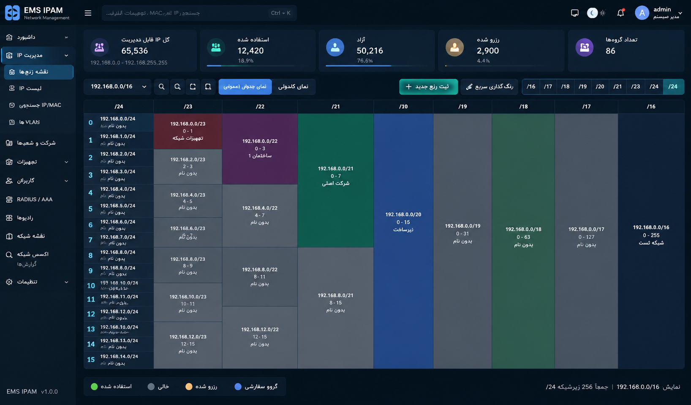

# EMS_IPAM — Stage 01 Base + IPAM v1.4.0-stage1

Repository: `github.com/emsebi/EMS_IPAM`  
طراح و توسعه‌دهنده: **Ebrahim Mamani / ابراهیم مامانی**

این خروجی **مرحله اول رسمی ساخت پروژه** است: پنل مرکزی، دیتابیس مشترک و IPAM. افزونه‌های Radio، RADIUS، Network Map، MAC Finder و Network Access در مراحل بعدی به همین Base اضافه می‌شوند و نباید برای توسعه آن‌ها Base از نو ساخته شود.

> تمام داده‌های Demo داخل سورس ساختگی هستند و برای GitHub تهیه شده‌اند. هیچ نام شرکت، شعبه، رنج یا تجهیز واقعی در Seed/Mock/Documentation قرار داده نشده است.



## نصب با یک دستور

```bash
curl -fsSL https://raw.githubusercontent.com/emsebi/EMS_IPAM/main/install.sh | sudo bash
```

منو:

```text
1) Install
2) Update
3) Uninstall application (keep database)
4) Uninstall application + database
```

### ایمنی Update

گزینه **Update** برای حفظ اطلاعات طراحی شده است:

- قبل از تغییر Application، Backup اجباری PostgreSQL ساخته و غیرخالی بودن آن بررسی می‌شود.
- Docker volume با نام `ems_ipam_db_data` در Update حذف نمی‌شود.
- فایل تنظیمات `/var/lib/ems-ipam/.env` در Update بازنویسی نمی‌شود.
- فایل‌های برنامه به صورت Staged جایگزین می‌شوند.
- اگر Health Check نسخه جدید Fail شود، فایل‌های Application به نسخه قبلی Rollback می‌شوند.
- Backup قبل از Update در `/var/lib/ems-ipam/backups` باقی می‌ماند.
- تنها گزینه **4** اجازه حذف Database/State را دارد و قبل از حذف تأیید می‌گیرد.

راهنمای کامل: [`docs/INSTALL-FA.md`](docs/INSTALL-FA.md)

## امکانات Base فعلی

### Core

- Login / Logout و Session
- Admin / Support / Helpdesk / Viewer
- Create / Edit / Delete / Enable / Disable کاربران
- دسترسی به شرکت‌ها و Address Spaceها
- **دسترسی مستقل به ماژول‌ها برای هر User**
- Settings متمرکز
- Light / Dark Theme
- Profile menu و About
- Personnel مرکزی با کد پرسنلی
- Inventory مشترک تجهیزات
- Custom Fields
- Audit Log
- Backup دستی و زمان‌بندی‌شده
- Global Search با پیشنهاد لحظه‌ای و Keyboard navigation

### Company / Branch / Site

- Company / Branch / Site / Customer
- Parent/Child
- کد، آدرس، تلفن، مدیر، کدپستی
- Latitude / Longitude
- چند Contact با نام، سمت، تلفن، موبایل و Email
- Personnel مرتبط با همان شعبه/شرکت و کد پرسنلی
- چند IP/Link برای Router/WAN
- روش اتصال Web / HTTPS / SSH / WinBox و Custom Port
- Notes
- Create / Edit / Delete

### IPAM

- Root Address Space از `/16` تا `/24`
- نمای پیش‌فرض **جدول عمودی CIDR**
- `/24` سمت چپ و `/23 ... /16` با ارتفاع واقعی بر اساس تعداد `/24`های زیرمجموعه
- کلیک روی **متن CIDR** = ورود دقیقاً به همان Range
- کلیک روی **مربع کوچک رنگ** = فقط Name / Description / Color همان Range
- رنگ Range به Childها ارث داده نمی‌شود
- Range بدون Group خاکستری باقی می‌ماند
- رنگ پیشنهادی خودکار برای Group جدید و تلاش برای جلوگیری از تکرار رنگ هم‌سطح
- Tile view اختیاری
- Drill-down تا `/30` و سپس چهار IP مجزا
- `/31` به عنوان مرحله جدا در UI نمایش داده نمی‌شود
- IP detail با Previous / Next
- Hostname / MAC / VLAN / Owner / Location / Vendor / Model / Serial / Firmware / Notes
- Ping status
- Service shortcuts و پورت قابل تنظیم
- Import / Export

## اتصال Base به افزونه‌های آینده

همه بخش‌ها از **یک PostgreSQL مشترک** و IDهای مشترک استفاده خواهند کرد. افزونه‌ها نباید رکورد IP/Device جداگانه بسازند.

```text
Core + IPAM
├── Inventory
├── Personnel
├── modules/radio
├── modules/radius
├── modules/network-map
├── modules/mac-finder
└── modules/network-access
```

Module access از همین نسخه در فرم User وجود دارد. افزونه‌های جدید نیز با `module.json` به Catalog دسترسی‌ها اضافه می‌شوند.

## Upload به GitHub

ZIP تحویلی پوشه والد اضافی ندارد. محتویات ZIP را مستقیم در Root مخزن زیر Extract/Upload کنید:

```text
https://github.com/emsebi/EMS_IPAM
```

بعد همان یک دستور Installer را اجرا کنید.

## تست محلی UI بدون دیتابیس

برای توسعه Frontend، Mock data فقط داده‌های ساختگی دارد. در صورت Serve کردن `docker-app/public`، آدرس را با `?mock` باز کنید.

## مستندات

- [`docs/INSTALL-FA.md`](docs/INSTALL-FA.md)
- [`docs/ARCHITECTURE-FA.md`](docs/ARCHITECTURE-FA.md)
- [`docs/MODULE-SDK-FA.md`](docs/MODULE-SDK-FA.md)
- [`docs/TEST-REPORT-FA.md`](docs/TEST-REPORT-FA.md)


## محدوده مرحله اول

- [Stage 01 Scope](docs/STAGE-01-SCOPE-FA.md)
- [Update Safety](docs/UPDATE-SAFETY-FA.md)
