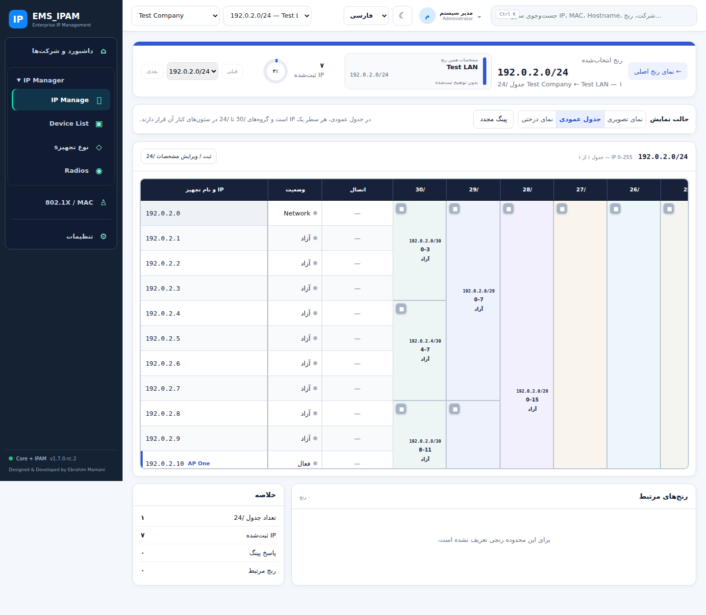
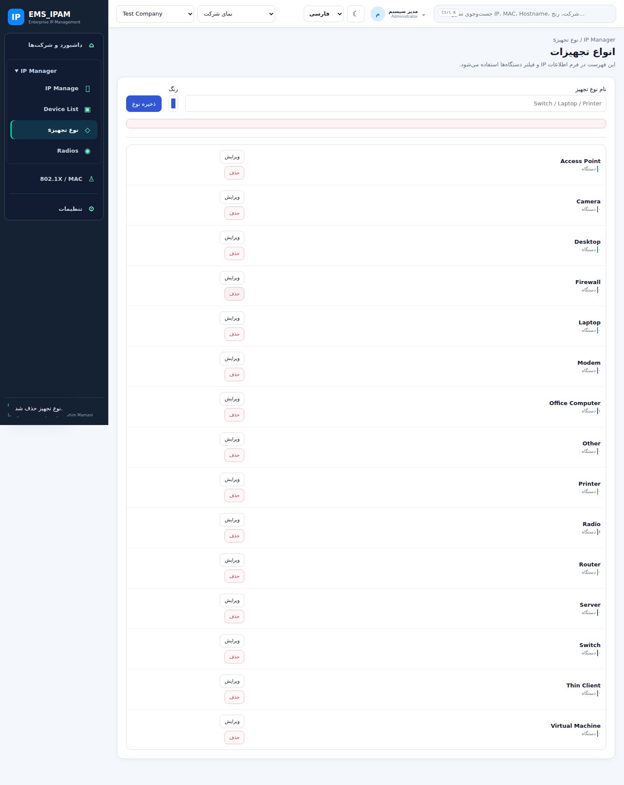
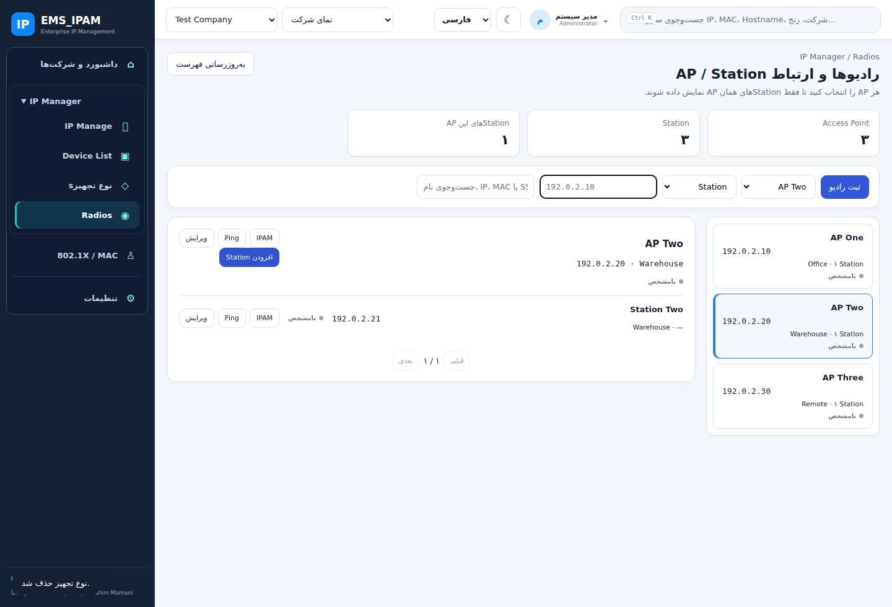
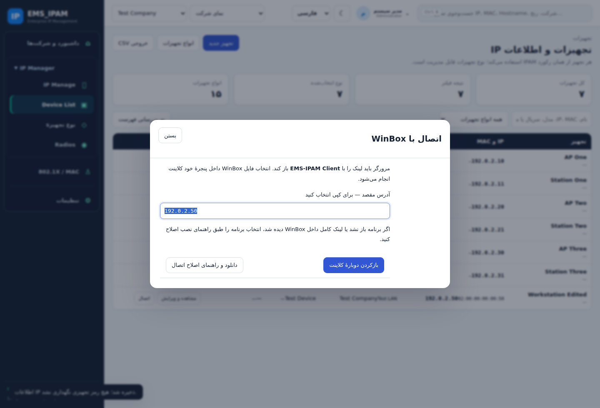

# EMS_IPAM — Part 1 / v1.7.0-rc.2

پنل مدیریت شبکه؛ **Core + IPAM + Radio** در این تحویل آمادهٔ تست است. بخش‌های RADIUS، کشف خودکار توپولوژی و اعمال دسترسی MAC در مراحل جدا تحویل می‌شوند.

## دانلود و نصب با یک دستور

روی Ubuntu/Debian با دسترسی sudo و اینترنت، همین دستور را کپی کنید؛ نصب‌کننده پیش‌نیازها، Docker و Compose را بررسی می‌کند و منوی نصب/ارتقا را می‌آورد:

```bash
sudo bash -c 'set -e; command -v curl >/dev/null || { apt-get update; apt-get install -y ca-certificates curl; }; EMS_SETUP=$(mktemp); trap "rm -f \"$EMS_SETUP\"" EXIT; curl -fsSL --retry 3 https://raw.githubusercontent.com/emsebi/EMS_IPAM/main/install.sh -o "$EMS_SETUP"; bash "$EMS_SETUP"'
```

**این دستور کد منتشرشدهٔ شاخه main را دریافت می‌کند. اگر این بسته را از گفتگو گرفته‌اید، ابتدا تغییرات را در مخزن منتشر کنید؛ تا آن زمان از روش نصب دستی ZIP زیر استفاده کنید.**

**نصب تازه: گزینه 1. ارتقای نصب موجود: گزینه 2.** پس از ساخت سرویس‌ها، آدرس پنل چاپ می‌شود؛ پورت پیش‌فرض 8080 است. نصب‌کننده نام مدیر و رمزها را می‌پرسد. Portainer اختیاری است و پیش‌فرض نصب نمی‌شود.

پیش‌نیازها: Ubuntu/Debian، دسترسی sudo و اینترنت. Docker Engine و Compose در صورت نیاز نصب می‌شوند؛ سرویس نصب‌شدهٔ قبلی بررسی می‌شود. برای ارتقا، نصب‌کننده پیش از تغییر برنامه بکاپ دیتابیس می‌گیرد.

## نصب دستی از فایل دانلودشده

[دانلود ZIP پروژه](https://github.com/emsebi/EMS_IPAM/archive/refs/heads/main.zip) — یا از منوی **Code → Download ZIP** همین مخزن استفاده کنید. فایل معمولاً `EMS_IPAM-main.zip` نام دارد.

اگر ZIP را قبلاً دانلود و به سرور منتقل کرده‌اید، در همان پوشه اجرا کنید؛ استخراج در یک پوشهٔ تازه انجام می‌شود تا فایل‌های قدیمی با نسخهٔ جدید مخلوط نشوند:

```bash
sudo apt-get update && sudo apt-get install -y unzip
EMS_SOURCE=$(mktemp -d "$PWD/EMS_IPAM-install.XXXXXX")
unzip EMS_IPAM-main.zip -d "$EMS_SOURCE"
cd "$EMS_SOURCE/EMS_IPAM-main"
sudo bash install.sh
```

برای دانلود ZIP در خود سرور، پیش از دستورهای استخراج بالا اجرا کنید:

```bash
sudo apt-get update && sudo apt-get install -y ca-certificates curl
curl -fL --retry 3 https://github.com/emsebi/EMS_IPAM/archive/refs/heads/main.zip -o EMS_IPAM-main.zip
```

در هر دو روش، **گزینه 1 برای نصب تازه و گزینه 2 برای ارتقا** است. پایان نصب، آدرس ورود مانند `http://SERVER-IP:8080` چاپ می‌شود. راهنمای تست و عیب‌یابی در [START-HERE-FA.md](START-HERE-FA.md) آمده است.

## کلاینت نهایی ویندوز 0.8.0

[دانلود ZIP کلاینت](https://raw.githubusercontent.com/emsebi/EMS_IPAM/main/docker-app/public/downloads/EMS-IPAM-Windows-Client-v0.8.0.zip)

ZIP را استخراج و `Install.cmd` را با کاربر خودتان اجرا کنید. سپس `Configure-WinBox.cmd` را برای انتخاب WinBox اجرا کنید. در پنجرهٔ انتخاب برنامهٔ **مرورگر**، `EMS-IPAM Client` را معرفی کنید:

```text
%LOCALAPPDATA%\EMS-IPAM-Client\EMS-IPAM-Client.exe
```

اگر قبلاً WinBox را در مرورگر انتخاب کرده‌اید، همان انتخاب ذخیره‌شده را طبق [راهنمای اصلاح اتصال](docs/WINDOWS-CLIENT-FA.md) عوض کنید. برای IP نمونهٔ `192.168.1.4` و پورت 8291، کادر Connect To باید فقط `192.168.1.4` باشد. `Test.cmd` تست آفلاین و `Check.cmd` بررسی ثبت کلاینت است.

## این نسخه چه دارد؟

| بخش | کاربرد فعلی |
|---|---|
| IP Manager → IP Manage | شرکت، رنج، IP، جست‌وجو و مشخصات آدرس‌ها |
| IP Manager → Device List | فهرست تجهیزات و انتخاب نوع در فرم IP |
| IP Manager → Device Types | افزودن، ویرایش، حذف نوع آزاد و تعداد استفاده؛ مستقل از Settings |
| IP Manager → Radios | انتخاب AP و نمایش فقط Stationهای همان AP؛ Ping دستی |
| 802.1X / MAC | دو تب رکوردهای MAC موجود در IPAM و پرسنل؛ فعلاً بدون اعمال سیاست RADIUS |
| مدیریت پنل | کاربران، دسترسی‌ها، تنظیمات، بکاپ و مهاجرت ثبت‌شدهٔ دیتابیس |
| اتصال ویندوز | کلاینت 0.8.0 برای WinBox، RDP، SSH، Telnet و VNC |

به‌روزرسانی MAC از سوئیچ‌ها در مراحل بعد فقط با درخواست دستی کاربر انجام می‌شود؛ تایمر یا خواندن خودکار هنگام بازکردن صفحه نداریم.

## اصلاحات این تحویل

- لانچر مشخص `EMS-IPAM-Client.exe` داخل ZIP است و هنگام نصب در ویندوز ثبت می‌شود؛ پورت 8291 فقط IP به WinBox می‌دهد، پورت سفارشی `IP:PORT`.
- نصب مجدد مسیر انتخاب‌شدهٔ ابزارها را حفظ می‌کند. خطای اتصال پیام دارد و `Check.cmd` وضعیت ثبت پروتکل را نشان می‌دهد.
- پنل پس از MIK، آدرس مقصد، تلاش دوباره و راهنمای اصلاح برنامهٔ مرورگر را نمایش می‌دهد.
- فقط ZIP کلاینت 0.8.0 در دانلودهای پنل باقی مانده است؛ هفت نسخهٔ قدیمی حذف شده‌اند.
- نصب یک‌دست با مخزن رسمی Docker؛ اجرای نصب‌کننده از فایل یا ورودی استاندارد پشتیبانی می‌شود.

## تصاویر اجرای واقعی پنل

این تصاویر از تست مرورگر با داده‌های آزمایشی گرفته شده‌اند.










طرح قدیمی [Subnet](docs/screenshots/subnet-overview-concept.png) صرفاً مرجع مفهومی است.

## نصب، تست و ادامه پروژه

- [شروع نصب و تست](START-HERE-FA.md)
- [راهنمای کلاینت و اصلاح WinBox](docs/WINDOWS-CLIENT-FA.md)
- [گزارش تست و محدودیت‌ها](docs/TEST-REPORT-FA.md)
- [نقشهٔ راه پنج‌مرحله‌ای](docs/ROADMAP-FA.md)
- [نقطهٔ ادامه کار](CONTINUATION.md) و [قرارداد ماژول‌ها](docs/MODULE-SDK-FA.md)

تست پنل با سرور واقعی و دیتابیس موقت PGlite انجام می‌شود. Docker/PostgreSQL واقعی و WinBox روی ویندوز در محیط ساخت اجرا نشده‌اند؛ اسکریپت‌های پذیرش داخل بسته‌اند. نسخه RC است و نتیجهٔ تست دستگاه واقعی باید جدا ثبت شود.

طراح پروژه: Ebrahim Mamani / ابراهیم مامانی
