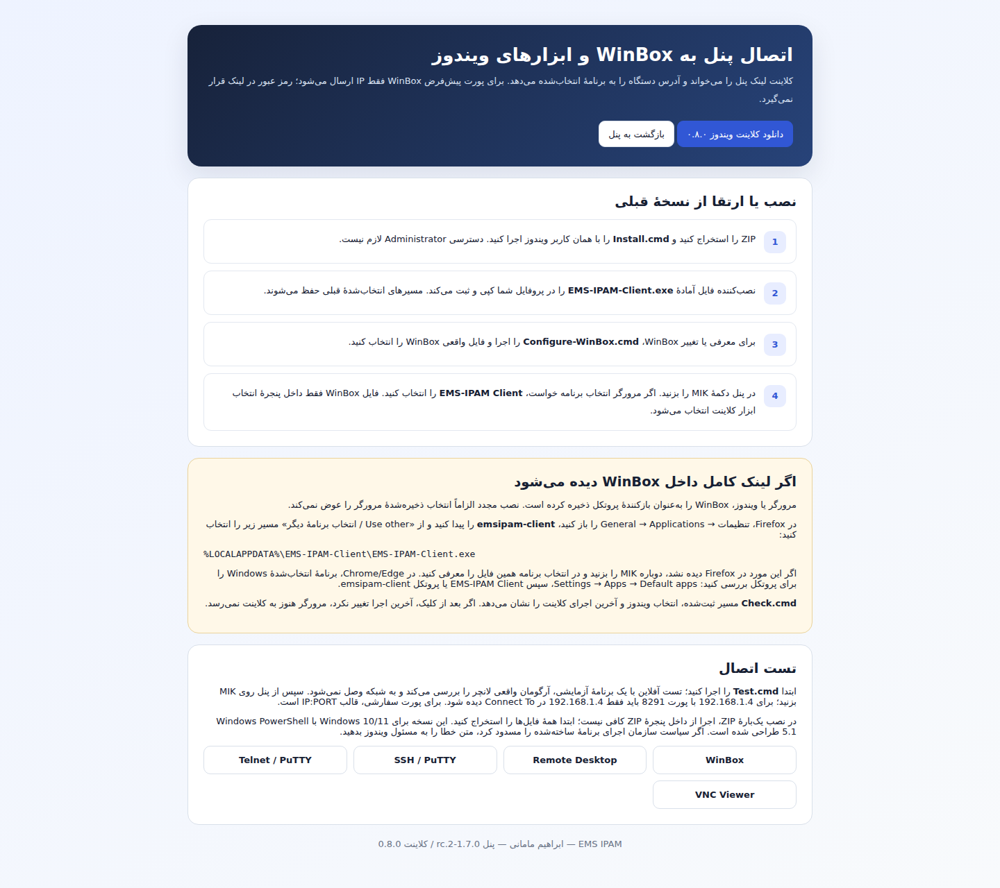

# کلاینت ویندوز 0.8.0

لانچر آمادهٔ `EMS-IPAM-Client.exe` همراه ZIP است؛ نصب، آن را در پروفایل کاربر کپی و برای دو پروتکل `emsipam-client` و `emsipam` ثبت می‌کند. نصب مجدد مسیر ابزارها را حفظ می‌کند. Windows PowerShell 5.1 و .NET Framework 4.8 برای اجرا لازم‌اند؛ SDK لازم نیست.

1. ZIP را کامل استخراج کنید و `Install.cmd` را اجرا کنید.
2. با `Configure-WinBox.cmd` فایل واقعی WinBox را معرفی کنید.
3. MIK را در پنل بزنید. در انتخاب برنامهٔ مرورگر، **EMS-IPAM Client** را انتخاب کنید.
4. `Test.cmd` تست آفلاین و `Check.cmd` اطلاعات آخرین اجرا را ارائه می‌کنند.

## رفع لینک کامل داخل WinBox

تصویر گزارش‌شده نشان می‌دهد URI به WinBox رسیده و مرحلهٔ تبدیل لینک به آدرس دور زده شده است. انتخاب WinBox در مرورگر باید به لانچر زیر تغییر کند:

```text
%LOCALAPPDATA%\EMS-IPAM-Client\EMS-IPAM-Client.exe
```

Firefox: Settings → General → Applications، مورد `emsipam-client`، سپس Use other و مسیر بالا. اگر مورد هنوز وجود ندارد، دوباره MIK را بزنید و همین فایل را معرفی کنید. Chrome/Edge از انتخاب سیستم استفاده می‌کنند؛ Windows Settings → Apps → Default apps، برنامه EMS-IPAM Client یا پروتکل `emsipam-client` را بررسی کنید. Repair.cmd ثبت کلاینت را ترمیم می‌کند؛ انتخاب ذخیره‌شدهٔ مرورگر را به‌زور تغییر نمی‌دهد.

| ورودی | آرگومان WinBox |
|---|---|
| 192.168.1.4، پورت 8291 | `192.168.1.4` |
| 192.168.1.4، پورت 9191 | `192.168.1.4:9191` |
| 2001:db8::4، پورت 8291 | `[2001:db8::4]` |

هیچ رمز عبوری در لینک نیست. کلاینت نوع ابزار، IP، پورت و نام کاربری اختیاری را اعتبارسنجی می‌کند. خطاها پنجرهٔ قابل مشاهده و گزارش `last-launch.txt` دارند. اگر بعد از کلیک، زمان گزارش تغییر نکرد، مرورگر هنوز لانچر را اجرا نکرده است.

## تست و ساخت

۲۲ تست منطق در PowerShell 7.4.6 روی Linux پاس شده و لانچر C# با مراجع Microsoft .NET Framework 4.8 کامپایل شده است. اجرای WinBox و ثبت پروتکل روی Windows در محیط ساخت در دسترس نبوده است. Test.cmd روی Windows، علاوه بر تست منطق، لانچر را با برنامهٔ ضبط‌کنندهٔ آزمایشی اجرا می‌کند؛ ۲۶ بررسی و بدون اتصال به شبکه. `Build-EMS-Client.ps1` برای بازسازی اختیاری توسط توسعه‌دهنده با Windows PowerShell 5.1 است.



مراجع فنی: [WinBox CLI](https://help.mikrotik.com/docs/spaces/ROS/pages/328129/WinBox)، [ثبت برنامه در Windows](https://learn.microsoft.com/en-us/windows/win32/shell/default-programs).
